# Arritmias cardíacas: del mecanismo al diagnóstico y la conducta clínica

Capítulo de estudio de **BADBEAR.MED · WAJOMEA.GROUP**. Desarrollo académico ampliado de arritmias cardíacas. Revisión: **4 de octubre de 2026**. Incluye explicaciones, tablas comparativas, imágenes comentadas y casos clínicos razonados.

## 1. Qué es una arritmia y por qué importa {#concepto}

Una arritmia es una alteración de la formación del impulso eléctrico, de su propagación o de ambos procesos. Puede modificar la frecuencia, la regularidad, el lugar de origen de la activación o la relación entre aurículas y ventrículos. Por ello, una frecuencia de 80 latidos por minuto no excluye una arritmia: una fibrilación auricular con respuesta controlada o un bloqueo con ritmo de escape pueden encontrarse dentro de ese rango.

El análisis debe resolver cuatro preguntas: **qué ritmo existe, qué mecanismo lo mantiene, qué repercusión produce y qué sustrato lo explica**. La misma frecuencia puede tener significados distintos. Una taquicardia sinusal de 130/min durante una hemorragia es una respuesta compensadora; una taquicardia ventricular de 130/min en una persona con cicatriz de infarto puede ser una arritmia potencialmente letal. Frenar la primera sin corregir la pérdida de volumen puede deteriorar la perfusión.

El gasto cardíaco depende de la frecuencia y del volumen sistólico. Una frecuencia excesiva acorta la diástole, dificulta el llenado y disminuye el tiempo de perfusión coronaria; una frecuencia demasiado baja puede impedir un gasto suficiente. La pérdida de la contracción auricular organizada afecta especialmente a pacientes con ventrículos poco distensibles. La activación ventricular desincronizada puede reducir la eficiencia mecánica. El riesgo no se deduce únicamente del número que muestra el monitor.

La importancia clínica incluye síncope, insuficiencia cardíaca, isquemia por desequilibrio de aporte y demanda, tromboembolia en determinadas arritmias auriculares, miocardiopatía inducida por taquicardia y muerte súbita. Algunas extrasístoles aisladas son incidentales; otras anuncian enfermedad estructural o un trastorno eléctrico hereditario. El contexto transforma el hallazgo.

<strong>BADBEAR.MED FIJA:</strong> describir una arritmia exige ritmo, frecuencia, regularidad, QRS, actividad auricular y repercusión clínica. «Está taquicárdico» es una observación, todavía no es un diagnóstico.

## 2. Anatomía funcional del sistema de conducción {#conduccion}

El nodo sinusal se sitúa en la región superior de la aurícula derecha, cerca de la desembocadura de la vena cava superior. Sus células generan impulsos espontáneos que se distribuyen por el miocardio auricular. La conducción hacia la aurícula izquierda incluye conexiones interauriculares, entre ellas el haz de Bachmann. La onda P expresa la despolarización auricular conjunta; no es el registro directo del nodo sinusal.

El nodo auriculoventricular se encuentra en la región del triángulo de Koch. La conducción nodal es relativamente lenta y decremental: ante impulsos muy rápidos puede conducir con mayor retraso o bloquear algunos de ellos. Este comportamiento permite que el ventrículo no reproduzca necesariamente toda la frecuencia auricular, como ocurre en el flutter. El retraso también favorece la secuencia mecánica entre contracción auricular y ventricular.

El impulso alcanza el haz de His, las ramas y la red de Purkinje. Su conducción rápida coordina la activación ventricular. La rama izquierda posee fascículos; un bloqueo en distintos niveles puede modificar el eje o ensanchar el QRS. En el corazón normal, el esqueleto fibroso separa eléctricamente las aurículas de los ventrículos, salvo la conexión especializada del sistema AV. Una vía accesoria constituye una conexión adicional que puede participar en preexcitación o reentrada.

| Estructura | Función dominante | Traducción clínica |
|---|---|---|
| Nodo sinusal | Marcapasos fisiológico | Disfunción: bradicardia, pausas, incompetencia cronotrópica |
| Miocardio auricular | Propagación y contracción auricular | Focos ectópicos, flutter, fibrilación auricular |
| Nodo AV | Retraso y filtrado de impulsos | Reentrada nodal; algunos bloqueos; efecto de maniobras vagales |
| His-Purkinje | Activación ventricular rápida | Bloqueos infranodales, bloqueos de rama, reentrada entre ramas |
| Miocardio ventricular | Contracción coordinada | Extrasístoles, circuitos alrededor de cicatrices, TV y FV |

El nodo sinusal suele dominar por su mayor frecuencia espontánea y por la supresión de otros marcapasos durante la estimulación repetida. Si falla, un foco subsidiario puede producir un **escape**. Las frecuencias orientativas son aproximadamente 40–60/min para escapes de la unión y 20–40/min para escapes ventriculares, con variabilidad según enfermedad, fármacos y autonomía. No son criterios absolutos para identificar el origen.

La irrigación importa: la arteria del nodo sinusal puede originarse en la coronaria derecha o en la circunfleja; la del nodo AV suele relacionarse con la dominancia coronaria. Un infarto inferior puede acompañarse de bradicardia o bloqueo nodal por isquemia y reflejos vagales; un infarto anterior con bloqueo infranodal sugiere daño extenso del sistema de conducción y mayor gravedad.

## 3. Potencial de acción: las bases que explican el ECG y los fármacos {#potencial}

Las células cardíacas no tienen un potencial de acción idéntico. En miocitos auriculares, ventriculares y muchas fibras de Purkinje, la fase 0 depende predominantemente de la entrada rápida de sodio; en las células nodales, la despolarización ascendente depende principalmente del calcio. Esta diferencia explica por qué algunos fármacos modifican sobre todo la conducción nodal y otros la propagación por miocardio y His-Purkinje.

| Fase en una célula de respuesta rápida | Proceso predominante | Relación con las arritmias |
|---|---|---|
| 0 | Entrada rápida de Na⁺ | Determina velocidad de ascenso y contribuye a la conducción |
| 1 | Repolarización inicial | Corrientes transitorias de salida de K⁺ |
| 2 | Meseta: equilibrio entre entrada de Ca²⁺ y salida de K⁺ | Acoplamiento excitación-contracción; posdespolarizaciones precoces |
| 3 | Repolarización por corrientes de K⁺ | Duración del potencial y reserva de repolarización |
| 4 | Potencial de reposo relativamente estable | Puede aparecer automatismo anormal o actividad desencadenada |

En las células marcapasos, la fase 4 asciende espontáneamente. Participan la corriente *funny* y corrientes de calcio, con influencia del sistema autónomo. La estimulación simpática aumenta la frecuencia de descarga y favorece la conducción nodal; la parasimpática disminuye la frecuencia sinusal y enlentece la conducción AV. Una respuesta vagal intensa puede generar pausas o bloqueo nodal sin que exista necesariamente una lesión permanente.

La **refractariedad** es el período durante el cual el tejido no puede responder normalmente a otro estímulo. Durante el período refractario efectivo no se genera una respuesta propagada adecuada; en el relativo, un estímulo puede producir una respuesta diferente. Conducción y refractariedad no son sinónimos: una zona puede conducir lentamente y recuperarse a tiempo para recibir nuevamente una onda, situación que favorece reentrada.

La hiperkalemia inicialmente modifica la repolarización, pero al elevarse de forma importante despolariza el potencial de reposo e inactiva canales de sodio: puede ensanchar el QRS, reducir o borrar las ondas P y producir bloqueos o paro. La hipokalemia y la hipomagnesemia facilitan inestabilidad eléctrica y determinadas arritmias. El ECG orienta, pero no sustituye la medición de electrolitos ni permite estimar de forma exacta sus concentraciones.

<figure><a href="imagenes/arritmias/pdf-pagina-07.webp" target="_blank" rel="noopener">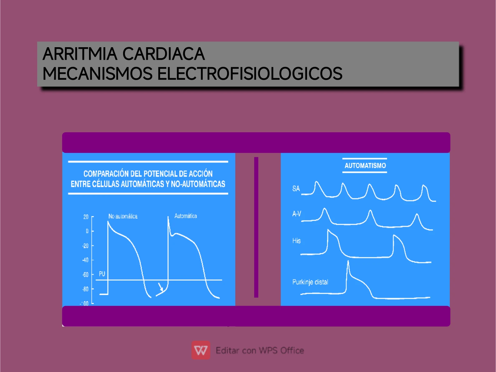</a><figcaption>Figura 1. Bases electrofisiológicas. PDF de apoyo, p. 7. El desplazamiento de la fase 4 y del umbral modifica el momento de la descarga; la interpretación debe distinguir células nodales de miocitos de respuesta rápida.</figcaption></figure>

## 4. Los tres mecanismos fundamentales {#mecanismos}

### Automatismo aumentado o anormal

El automatismo aumentado significa que un marcapasos fisiológico descarga con mayor rapidez. Puede aparecer por catecolaminas, fiebre o esfuerzo. El automatismo anormal surge en tejido que no debería actuar como marcapasos dominante, por alteraciones del potencial de reposo o del ambiente celular. Isquemia, lesión miocárdica y trastornos metabólicos pueden favorecerlo.

Las taquicardias automáticas pueden mostrar aceleración gradual al inicio y desaceleración al terminar, conocidas como *warm-up* y *cool-down*. Estos hallazgos apoyan un mecanismo, pero no sustituyen la demostración electrofisiológica. Un foco ectópico auricular produce ondas P con morfología diferente a la sinusal. El aumento de la frecuencia de un escape puede originar un ritmo acelerado, distinto de una taquicardia por reentrada.

### Actividad desencadenada

Las posdespolarizaciones dependen de un potencial de acción previo. Las **precoces** aparecen antes de que termine la repolarización, durante las fases 2 o 3; se relacionan con prolongación de la repolarización y pueden participar en torsades de pointes. La bradicardia, las pausas y algunos fármacos que prolongan el QT favorecen este escenario.

Las **tardías** aparecen después de la repolarización, habitualmente en fase 4, y se relacionan con sobrecarga intracelular de calcio. La intoxicación digitálica y la estimulación catecolaminérgica son ejemplos. Si la oscilación alcanza el umbral, genera un nuevo impulso. En términos prácticos: QT prolongado y pausas orientan hacia actividad precoz; digoxina, calcio intracelular y catecolaminas, hacia actividad tardía.

<figure><a href="imagenes/arritmias/pdf-pagina-10.webp" target="_blank" rel="noopener">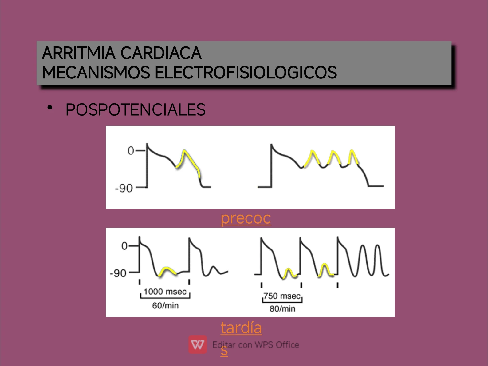</a><figcaption>Figura 2. Posdespolarizaciones. PDF de apoyo, p. 10. Importa cuándo aparece la oscilación respecto de la repolarización, no solo su tamaño.</figcaption></figure>

### Reentrada

Una onda vuelve a activar tejido que ya se despolarizó y se recuperó. Para sostener el circuito se necesitan trayectos disponibles, diferencias de conducción o refractariedad y condiciones que permitan que la onda regrese a tejido excitable. El bloqueo unidireccional permite que el impulso avance por un camino y no por otro; la conducción lenta da tiempo a que el trayecto inicialmente bloqueado se recupere.

En la AVNRT típica participan vías nodales de conducción rápida y lenta. En la AVRT intervienen el sistema AV normal y una vía accesoria. En el flutter típico existe un circuito auricular de macroreentrada; en muchas TV monomorfas posinfarto, el circuito atraviesa canales de tejido viable dentro o alrededor de una cicatriz. La fibrilación representa una organización mucho más compleja, con múltiples ondas o fuentes de activación.

La reentrada suele comenzar y terminar bruscamente. Un latido prematuro puede iniciar el circuito. Interrumpir un segmento crítico puede terminarla, fundamento de algunas maniobras, fármacos y ablaciones. Un medicamento que bloquea el nodo AV puede detener una AVNRT, pero no necesariamente una taquicardia auricular cuyo circuito no necesita ese nodo.

<figure><a href="imagenes/arritmias/pdf-pagina-11.webp" target="_blank" rel="noopener">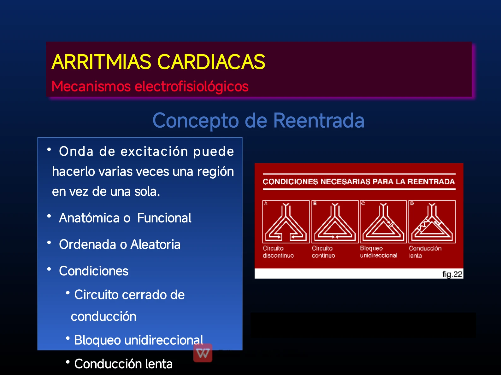</a><figcaption>Figura 3. Reentrada. PDF de apoyo, p. 11. El circuito debe encontrar tejido recuperado al completar cada vuelta; si la onda alcanza tejido todavía refractario, se extingue.</figcaption></figure>

### Mecanismos menos frecuentes y conceptos avanzados

La **parasístole** implica un foco que conserva cierta independencia respecto del ritmo dominante por protección de entrada; puede producir intervalos de acoplamiento variables y relaciones matemáticas entre descargas ectópicas. La **conducción oculta** es la penetración de un impulso en una estructura sin producir necesariamente una activación visible posterior, pero modificando su refractariedad. La **reflexión** es un mecanismo electrofisiológico especializado que no debe utilizarse como diagnóstico de superficie rutinario. Una clasificación mecanística ayuda a comprender, pero el mecanismo definitivo puede requerir un estudio electrofisiológico.

## 5. Causas, desencadenantes y sustrato {#causas}

Conviene separar el **sustrato**, la **señal desencadenante** y los **moduladores**. Una cicatriz posinfarto puede ser el sustrato; una extrasístole, el desencadenante; la hipokalemia y las catecolaminas, los moduladores. Corregir el desencadenante no elimina siempre el riesgo que permanece en la cicatriz.

| Grupo | Ejemplos | Qué buscar |
|---|---|---|
| Isquémico | Infarto agudo, cicatriz de infarto, isquemia activa | Dolor, cambios ST-T, troponina interpretada en contexto |
| Estructural | Valvulopatías, dilatación, hipertrofia, miocardiopatías | Soplos, congestión, ecocardiografía |
| Inflamatorio o infiltrativo | Miocarditis, sarcoidosis, amiloidosis | Disfunción, bloqueos, arritmias y contexto sistémico |
| Infeccioso | Chagas, miocarditis; Lyme según exposición | Epidemiología, serología o estudios dirigidos |
| Eléctrico hereditario | QT largo, Brugada, TV catecolaminérgica | Síncope de esfuerzo o nocturno, familiares, ECG basal |
| Metabólico | Alteraciones de K⁺, Mg²⁺, Ca²⁺, hipoxia, acidosis | Electrolitos, función renal, gases cuando corresponda |
| Endocrino | Hipertiroidismo, hipotiroidismo | Clínica y función tiroidea según presentación |
| Fármacos y tóxicos | Digoxina, antiarrítmicos, estimulantes, cocaína | Dosis, interacciones, cambios recientes, eliminación renal |
| Autónomo o fisiológico | Sueño, ejercicio, dolor, estrés | Relación temporal, respuesta al estímulo y síntomas |

En nuestro contexto, la procedencia epidemiológica puede orientar hacia enfermedad de Chagas ante trastornos de conducción, TV y miocardiopatía compatible. No se diagnostica por la sola presencia de bloqueo de rama. La investigación debe justificar los estudios y evitar convertir toda palpitación en una batería indiscriminada de pruebas.

La combinación de medicamentos merece una revisión detallada. Un fármaco puede prolongar el QT; otro puede inhibir su metabolismo; un diurético puede disminuir potasio; una lesión renal puede aumentar su concentración. Cada elemento puede parecer moderado por separado y, combinado, producir un riesgo importante. Los suplementos y productos de venta libre también deben incluirse en la anamnesis.

## 6. Leer el ECG sin saltarse pasos {#lectura-ecg}

Antes de interpretar, confirme identidad, calidad, velocidad y ganancia. La calibración habitual es 25 mm/s y 10 mm/mV: un cuadrito horizontal equivale a 40 ms y uno grande a 200 ms. Con otra velocidad, las fórmulas cambian. Un temblor, una mala conexión o el movimiento de un cable puede simular fibrilación o TV; compare varias derivaciones y examine al paciente.

1. **Frecuencia:** en ritmo regular, 300 dividido por cuadrados grandes entre R o 1500 dividido por pequeños. En ritmo irregular, contar QRS en 10 segundos y multiplicar por 6 ofrece un promedio si el registro realmente dura 10 segundos.
2. **Regularidad:** analice R-R y, por separado, P-P. Una secuencia ventricular regular puede coexistir con actividad auricular independiente.
3. **Actividad auricular:** busque P en II, V1 y otras derivaciones; describa morfología, eje y frecuencia. Una P puede esconderse en la T o en el QRS.
4. **Relación AV:** cuántas P hay por QRS, si cada P conduce, si el PR cambia y si aurículas y ventrículos tienen una relación fija.
5. **QRS:** duración, eje y morfología; compare con un ECG previo cuando esté disponible.
6. **Repolarización:** ST, T y QT; en una taquicardia, la interpretación del QT exige especial cuidado y preferiblemente comparación tras controlar el ritmo.
7. **Conclusión:** formule un diagnóstico con grado de certeza y conducta, no una colección de medidas aisladas.

| Parámetro | Referencia práctica | Precisión necesaria |
|---|---|---|
| P sinusal | Habitualmente positiva en I y II, negativa en aVR | La morfología y la relación con QRS importan tanto como la polaridad |
| PR | 120–200 ms | PR corto no equivale automáticamente a WPW |
| QRS | Estrecho si <120 ms; ancho si ≥120 ms | El ancho no determina por sí solo origen ventricular |
| Frecuencia sinusal | Convención docente: 60–100/min | El estado fisiológico y los síntomas modifican su significado |
| QT | Desde inicio de QRS hasta final de T | Depende de la frecuencia; excluir la onda U separada |

### QT corregido: por qué una cifra aislada puede engañar

La fórmula de Bazett es QTc = QT / √RR, con QT y RR en segundos. Fridericia utiliza la raíz cúbica de RR. Bazett tiende a sobrecorregir a frecuencias rápidas y a infracorregir a frecuencias lentas. Con QRS muy ancho, parte del QT refleja despolarización prolongada y puede ser necesario valorar la repolarización mediante otros métodos, como JT, por personal experimentado.

Los límites de QTc dependen del sexo, la metodología y el contexto; aproximadamente >450 ms en hombres y >460 ms en mujeres orientan a prolongación, sin convertir una sola medición en diagnóstico de síndrome congénito. Un QTc ≥500 ms constituye una señal de riesgo que exige revisar fármacos, electrolitos y antecedentes. Una lectura automática debe confirmarse manualmente cuando la decisión depende de ella.

<strong>BADBEAR.MED FIJA:</strong> no escriba «QT normal» utilizando únicamente el intervalo sin corregir. Compruebe frecuencia, fórmula, final de la T y anchura del QRS.

## 7. Clasificación práctica: anchura y regularidad {#clasificacion}

Clasificar una taquicardia en cuatro casillas reduce errores. Esta clasificación organiza la evaluación inicial; no establece por sí sola el mecanismo definitivo.

| Patrón | Diagnósticos principales | Pista para razonar |
|---|---|---|
| Estrecho y regular | Sinusal, AVNRT, AVRT ortodrómica, auricular focal, flutter con conducción fija | P visible y comienzo gradual frente a inicio brusco y P oculta |
| Estrecho e irregular | FA, flutter variable, taquicardia auricular multifocal, ectopia frecuente | Ausencia de P organizada frente a múltiples P distintas |
| Ancho y regular | TV monomorfa, TSV con aberrancia, AVRT antidrómica, ritmo estimulado | Antecedente estructural, disociación AV, captura o fusión |
| Ancho e irregular | FA con aberrancia, FA preexcitada, TV polimorfa | Variación marcada del QRS y frecuencia extrema: pensar en preexcitación |

Una TV originada cerca del sistema de conducción puede tener un QRS relativamente estrecho; es una excepción que evita convertir «estrecho» en sinónimo absoluto de «supraventricular». A la inversa, una arritmia auricular puede tener QRS ancho por bloqueo de rama, aberrancia o vía accesoria. Ante una taquicardia de QRS ancho no aclarada, la conducta inicial debe proteger frente a la posibilidad de TV.

## 8. Anamnesis, examen y estudios dirigidos {#evaluacion}

Pregunte cómo comienza y termina el episodio, cuánto dura, con qué frecuencia aparece y qué lo desencadena. La sensación de un golpe seguido de pausa sugiere ectopia; un inicio súbito de palpitaciones rápidas y regulares orienta a una taquicardia paroxística. Ninguna descripción sustituye registrar el ritmo. La percepción de latidos cervicales durante una taquicardia regular puede relacionarse con contracción auricular contra válvulas AV cerradas.

El síncope durante esfuerzo, sin pródromos o asociado a palpitaciones merece especial atención. Investigue cardiopatía conocida, insuficiencia cardíaca, infarto, operaciones, antecedentes familiares de muerte súbita temprana, ahogamiento inexplicado o supuestas convulsiones sin diagnóstico claro. Describa medicamentos, dosis y consumo de alcohol o estimulantes. Pregunte por sangrado, fiebre, diarrea y otros desencadenantes reversibles.

En el examen, valore presión, perfusión, estado mental, respiración y congestión. Compare frecuencia del monitor con pulso: en FA o ectopia algunos latidos eléctricos no generan un pulso periférico perceptible, produciendo déficit de pulso. Las ondas A cañón intermitentes, un primer ruido variable y variación de la presión latido a latido pueden apoyar disociación AV, aunque su ausencia no descarta TV ni bloqueo completo.

| Estudio | Cuándo aporta | Limitación |
|---|---|---|
| ECG de 12 derivaciones | Episodio, basal y comparación | Un ECG entre episodios puede ser normal |
| Telemetría | Riesgo agudo o síntomas hospitalarios | Artefactos y alarmas requieren confirmación |
| Holter | Síntomas frecuentes o cuantificar carga | Un registro negativo breve no excluye eventos esporádicos |
| Monitor externo prolongado | Episodios menos frecuentes | Depende de duración, adherencia y activación |
| Registrador implantable | Síncope o episodios infrecuentes seleccionados | No sustituye tratar un riesgo ya demostrado |
| Ecocardiograma | Sospecha estructural, disfunción o valvulopatía | No identifica todas las cicatrices o canalopatías |
| Resonancia cardíaca | Miocarditis, infiltración, cicatriz, miocardiopatías | Indicación individual y compatibilidad de dispositivos |
| Prueba de esfuerzo | Síntomas de esfuerzo o respuesta cronotrópica | No se realiza de forma indiscriminada en cuadros inestables |
| Electrolitos, renal, hemograma, TSH | Según presentación y fármacos | La selección debe responder a una hipótesis |

La troponina puede elevarse por lesión miocárdica asociada a una taquicardia sostenida. No toda elevación representa un infarto tipo 1. Dolor, dinámica, ECG, contexto y evidencia de isquemia permiten distinguir causas. En una arritmia documentada, la ecocardiografía y la carga arrítmica ayudan a definir si existe cardiopatía previa o una disfunción inducida por el ritmo.

## 9. La primera decisión: pulso y estabilidad {#urgencias}

Una arritmia con hipotensión, shock, alteración aguda del estado mental, dolor isquémico o insuficiencia cardíaca aguda puede requerir intervención inmediata. Debe existir una relación razonable entre arritmia y deterioro. Una taquicardia sinusal por sepsis no se trata como una AVNRT solo porque la frecuencia sea alta. Evalúe vía aérea, ventilación, oxigenación, acceso venoso, monitorización y causas reversibles.

**Sin pulso:** una FV o TV sin pulso pertenece al algoritmo de paro, con RCP y desfibrilación temprana. Asistolia y actividad eléctrica sin pulso no son ritmos desfibrilables. Tras un choque, se reanudan compresiones siguiendo el algoritmo y se investigan causas reversibles. No se espera un ECG de 12 derivaciones para actuar.

**Con pulso y taquiarritmia causante de inestabilidad:** cardioversión sincronizada si el ritmo permite sincronización; la TV polimorfa sostenida requiere choque no sincronizado. Si el paciente está consciente, sedación cuando sea factible sin retrasar una intervención urgente.

**Con pulso y bradicardia causante de hipoperfusión:** soporte, corrección de causas y tratamiento dirigido; en bloqueos avanzados se prepara estimulación. **Con estabilidad:** es posible caracterizar el ECG y seleccionar una intervención con mayor precisión, pero estabilidad actual no significa ausencia de riesgo.

## 10. Taquicardia sinusal y extrasístoles auriculares {#sinusal}

La taquicardia sinusal conserva ondas P sinusales antes de cada QRS y habitualmente una relación AV 1:1. Suele iniciar y terminar gradualmente. Puede representar esfuerzo, ansiedad o dolor, pero también hipovolemia, anemia, hipoxia, embolia pulmonar, fiebre, hipertiroidismo o insuficiencia cardíaca. Atribuirla a ansiedad sin examinar al paciente es un error diagnóstico.

El objetivo es identificar el motivo de la respuesta simpática. Si la presión baja porque el volumen circulante es insuficiente, disminuir la frecuencia puede retirar una compensación. La taquicardia sinusal inapropiada requiere una evaluación específica y exclusión de causas secundarias; no se diagnostica por una única frecuencia elevada. La taquicardia ortostática tampoco equivale a cualquier taquicardia al ponerse de pie.

Una extrasístole auricular es una activación adelantada desde un foco auricular. La P suele diferir de la sinusal y puede deformar la T previa. El QRS puede ser estrecho, aberrante o no aparecer si el nodo AV está refractario. Una extrasístole auricular bloqueada puede simular una pausa sinusal o un bloqueo AV: buscar una P prematura escondida en la T evita confundir ambos fenómenos.

La pausa posterior suele ser no completamente compensadora porque el impulso ectópico puede reiniciar el nodo sinusal. El patrón no es universal. Las extrasístoles auriculares frecuentes pueden asociarse a mayor probabilidad de arritmias auriculares, pero no constituyen por sí mismas una indicación de anticoagulación ni justifican antiarrítmicos potentes en todas las personas.

## 11. Taquicardia por reentrada nodal: AVNRT {#supraventriculares}

La AVNRT, también denominada taquicardia por reentrada intranodal o TIN, es una taquicardia cuyo circuito se sitúa en el nodo AV y tejidos perinodales. La existencia de conducción funcional rápida y lenta permite que un impulso prematuro encuentre una vía refractaria y la otra disponible. En la forma típica, el impulso desciende por la vía lenta y retorna por la rápida: patrón **lento-rápido**.

La activación auricular y ventricular resulta casi simultánea. La P retrógrada puede no verse porque coincide con el QRS, generar una pequeña pseudo-r′ en V1 o una pseudo-S en derivaciones inferiores. El ECG suele mostrar una taquicardia regular y de QRS estrecho, con inicio y fin bruscos. Puede ensancharse si existe bloqueo de rama. La ausencia de P visible no significa ausencia de activación auricular.

En las formas atípicas, como rápido-lento o lento-lento, la relación temporal cambia y puede aparecer una taquicardia de RP largo. RP es el intervalo entre la activación ventricular y la siguiente onda P; PR va de la P al siguiente QRS. Diferenciar RP corto y largo orienta el diagnóstico, aunque no identifica inequívocamente el mecanismo.

Una persona joven puede referir episodios súbitos desencadenados por un latido adelantado, palpitaciones cervicales y resolución abrupta. La estabilidad permite intentar maniobras vagales y, si corresponde, adenosina; una arritmia causante de inestabilidad cambia la prioridad a cardioversión. La ablación de la vía lenta es una opción definitiva para episodios recurrentes o sintomáticos y requiere discutir eficacia, riesgo de bloqueo AV y preferencias.

### Valsalva modificado y respuesta a adenosina

El Valsalva utiliza una espiración forzada contra resistencia durante unos 15 segundos, seguida, en la variante modificada, de cambio a decúbito y elevación de piernas. Debe realizarse en un paciente apropiado y estable, con monitorización. Se evita recomendar masaje carotídeo como maniobra doméstica: sus contraindicaciones y riesgos requieren evaluación clínica.

La adenosina tiene vida media muy corta y puede interrumpir circuitos dependientes del nodo AV. Un bloqueo transitorio que descubre ondas de flutter sin terminar la actividad auricular aporta información diagnóstica. No convierte el flutter en AVNRT. La respuesta a adenosina no es una prueba absoluta de origen supraventricular, ya que algunas TV idiopáticas pueden responder.

## 12. Vías accesorias, AVRT y Wolff-Parkinson-White {#wpw}

En la AVRT, el circuito utiliza dos conexiones entre aurícula y ventrículo: habitualmente el sistema AV normal y una vía accesoria. En la **ortodrómica**, la conducción anterógrada ocurre por nodo AV–His-Purkinje y la retrógrada por la vía accesoria. El QRS suele ser estrecho, salvo aberrancia. En la **antidrómica**, la activación anterógrada se realiza por la vía accesoria; el QRS es ancho porque el ventrículo se activa de forma diferente.

Una vía que conduce solo retrógradamente se denomina oculta: puede sostener AVRT sin producir onda delta en ritmo sinusal. Por tanto, un ECG basal sin preexcitación no descarta una vía accesoria. Las vías tipo Mahaim y los circuitos con varias conexiones tienen propiedades específicas y requieren caracterización electrofisiológica; no se diagnostican únicamente por una etiqueta de QRS ancho.

El patrón clásico de preexcitación incluye PR corto, onda delta y ensanchamiento del QRS. La delta corresponde a activación ventricular anticipada y lenta desde el punto de inserción de la vía, antes de completarse la activación por el sistema normal. La repolarización secundaria puede generar cambios ST-T y ondas que simulan un infarto. **Patrón WPW** describe el hallazgo electrocardiográfico; **síndrome WPW** agrega la asociación clínica con taquiarritmias.

### Fibrilación auricular preexcitada: una excepción decisiva

Si la aurícula fibrila y los impulsos alcanzan el ventrículo por una vía accesoria capaz de conducir rápidamente, el nodo AV pierde su papel de filtro. Aparece una taquicardia muy rápida, irregular, con QRS de anchura y morfología variables; puede degenerar en FV. La combinación «irregular + ancho + muy rápido» exige considerar este diagnóstico.

En FA preexcitada están contraindicados los bloqueadores nodales AV: adenosina, verapamilo, diltiazem, betabloqueadores, digoxina y amiodarona. En inestabilidad se utiliza cardioversión eléctrica; en estabilidad pueden considerarse procainamida o ibutilida bajo monitorización y supervisión experta. La ablación de la vía es el tratamiento definitivo de referencia. Esta contraindicación no debe trasladarse sin matices a toda AVRT ortodrómica regular.

<strong>BADBEAR.MED FIJA:</strong> una FA preexcitada no se maneja como una FA común. Bloquear únicamente el nodo AV puede favorecer conducción ventricular peligrosa por la vía accesoria.

## 13. Taquicardia auricular, multifocal y de la unión {#auricular}

La **taquicardia auricular focal** nace de una zona auricular distinta del nodo sinusal. Presenta ondas P de morfología anormal, con frecuencia auricular elevada; la relación con el ventrículo puede ser 1:1 o incluir bloqueo AV. Una frecuencia ventricular menor por bloqueo no elimina la taquicardia auricular. Si es automática, puede mostrar calentamiento y enfriamiento progresivos; si es incesante, puede inducir disfunción ventricular.

La **taquicardia auricular multifocal** presenta ritmo irregular, al menos tres morfologías diferentes de P en una misma derivación y variación de PP, PR y RR, con línea isoeléctrica entre las P. Se diferencia de FA porque conserva actividad auricular discreta identificable. Se relaciona con enfermedad pulmonar, hipoxia, alteraciones electrolíticas y determinados medicamentos. Una frecuencia inferior a 100/min con ese patrón suele denominarse marcapasos auricular migratorio.

La **taquicardia de la unión** puede resultar de automatismo aumentado cerca de la unión AV. Las P pueden estar ausentes en superficie, ser retrógradas o mostrar disociación. El ritmo acelerado de la unión, la taquicardia no paroxística y la AVNRT no son sinónimos. La intoxicación digitálica, situaciones posoperatorias y otros contextos orientan el mecanismo.

En la taquicardia multifocal, el eje del tratamiento es corregir enfermedad subyacente y electrolitos; la cardioversión no suele resolver el mecanismo automático. Las taquicardias auriculares focales recurrentes o incesantes pueden requerir ablación. La conducta farmacológica debe valorar función ventricular, enfermedad pulmonar y posibles causas tóxicas.

<figure><a href="imagenes/arritmias/pdf-pagina-31.webp" target="_blank" rel="noopener">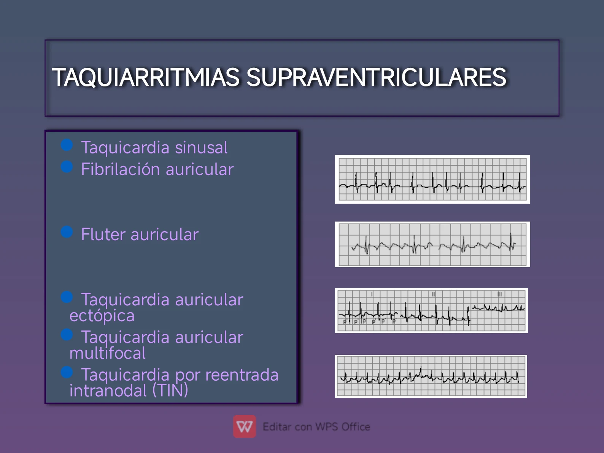</a><figcaption>Figura 4. Actividad auricular en distintos ritmos. PDF de apoyo, p. 31. La lámina reúne varios ejemplos: identifique P, ondas de flutter o actividad desorganizada antes de asignar un diagnóstico. Las tiras esquemáticas no sustituyen el ECG completo.</figcaption></figure>

## 14. Flutter auricular {#flutter}

El flutter es una taquicardia auricular organizada, habitualmente por macroreentrada. El típico utiliza el istmo cavotricuspídeo y un circuito alrededor del anillo tricuspídeo. La frecuencia auricular suele estar alrededor de 250–350/min, pero cambia con el sustrato y los medicamentos. En la forma típica antihoraria son frecuentes ondas en dientes de sierra negativas en derivaciones inferiores y positivas en V1; las variantes pueden mostrar otra morfología.

La conducción AV 2:1 puede producir una frecuencia ventricular cercana a 150/min y un ritmo aparentemente regular. Una de cada dos ondas auriculares puede quedar oculta en el QRS o la T. Cuando la relación cambia a 3:1 o 4:1, disminuye la frecuencia ventricular; si varía, aparece irregularidad. No todo flutter conduce a 150/min ni toda frecuencia de 150 corresponde a flutter.

La adenosina puede aumentar transitoriamente el bloqueo AV y hacer visibles las ondas auriculares, sin interrumpir el circuito del flutter. El diagnóstico se apoya en ECG de varias derivaciones y registro durante la maniobra cuando se utiliza de forma adecuada. La cardioversión puede restaurar el ritmo; la ablación del istmo constituye una estrategia eficaz para flutter típico. El riesgo tromboembólico requiere evaluación y no desaparece por tener actividad auricular organizada.

### Comparación de taquicardias regulares estrechas

| Característica | Sinusal | AVNRT típica | AVRT ortodrómica | Flutter 2:1 |
|---|---|---|---|---|
| Inicio habitual | Gradual | Brusco | Brusco | Variable |
| Actividad auricular | P sinusal | P oculta o retrógrada cercana | P retrógrada tras QRS, a veces visible | Ondas F; una puede ocultarse |
| Nodo AV indispensable para el circuito | No | Sí | Sí, en la forma habitual | No |
| Efecto de bloqueo nodal transitorio | Enlentece respuesta | Puede terminar | Puede terminar | Puede revelar flutter |
| Conducta clave | Corregir causa | Interrumpir circuito y valorar ablación | Considerar vía accesoria | Valorar ritmo, frecuencia y embolia |

## 15. Fibrilación auricular: tres decisiones diferentes {#fibrilacion}

La FA presenta activación auricular desorganizada, ausencia de P reproducibles e intervalos RR irregularmente irregulares cuando la conducción AV es variable. El ventrículo puede estar rápido, controlado o lento. En presencia de bloqueo AV completo, estimulación o determinadas circunstancias, una FA puede tener respuesta ventricular regular; por ello, la regularidad no debe interpretarse sin valorar actividad auricular y sistema de conducción.

La pérdida de contracción auricular y la estasis, especialmente en la orejuela izquierda, ayudan a explicar el riesgo embólico. La respuesta ventricular rápida puede empeorar llenado y función ventricular. Al mismo tiempo, dilatación auricular, fibrosis, hipertensión, valvulopatías, obesidad, apnea del sueño y disfunción ventricular favorecen el mantenimiento de FA. Existe una relación bidireccional entre FA e insuficiencia cardíaca.

| Patrón temporal | Concepto |
|---|---|
| Primer diagnóstico | Primera documentación, aunque la duración previa sea desconocida |
| Paroxística | Episodios que terminan dentro de 7 días |
| Persistente | Actividad continua de duración superior a 7 días |
| Persistente de larga duración | Actividad continua superior a 12 meses |
| Permanente | Decisión compartida de no continuar intentando restaurar ritmo sinusal |

«Permanente» describe una estrategia clínica, no una imposibilidad biológica inmutable. La documentación del ritmo y del comienzo real condiciona las decisiones; el inicio de palpitaciones no demuestra siempre el inicio de FA.

### A. Controlar la frecuencia

Implica reducir la respuesta ventricular, sin necesariamente terminar FA. Se elige el fármaco según presión, función ventricular y comorbilidades. Betabloqueadores, digoxina y, con fracción de eyección apropiada, verapamilo o diltiazem son opciones. Los dos últimos se evitan en disfunción sistólica importante. No se aplica esta estrategia nodal a FA preexcitada.

### B. Restaurar o mantener ritmo sinusal

Puede utilizarse cardioversión eléctrica, farmacológica o ablación en pacientes seleccionados. La cardioversión urgente por deterioro no debe retrasarse para completar una evaluación electiva. En un paciente estable, la duración y el riesgo de trombo influyen en la preparación. Cuando la duración supera 24 horas, se utiliza una estrategia de seguridad: anticoagulación terapéutica previa de al menos tres semanas o imagen que excluya trombo, con anticoagulación posterior habitualmente por al menos cuatro semanas. Las excepciones se individualizan.

### C. Prevenir tromboembolia

La escala CHA₂DS₂-VA considera: insuficiencia cardíaca, hipertensión, edad ≥75 años (2), diabetes, ictus/AIT/embolia previa (2), enfermedad vascular y edad de 65–74 años. Con 1 punto se considera anticoagulación; con ≥2 se recomienda si el paciente es elegible. Otra estrategia de estratificación considera el riesgo anual y herramientas validadas como CHA₂DS₂-VASc. No deben mezclarse umbrales entre escalas.

Los anticoagulantes directos se prefieren en muchos pacientes, con excepciones como prótesis mecánica o estenosis mitral relevante. Aspirina no sustituye anticoagulación cuando esta está indicada. El riesgo de sangrado ayuda a corregir factores modificables; no debe usarse aisladamente para negar tratamiento. Restaurar ritmo sinusal no elimina automáticamente la indicación antitrombótica.

<strong>BADBEAR.MED FIJA:</strong> en FA, frecuencia, ritmo y anticoagulación responden a preguntas distintas. Una frecuencia normal no significa que el riesgo de ictus haya desaparecido.

## 16. Extrasístoles ventriculares y ritmos acelerados {#extrasistoles}

Una extrasístole ventricular es un complejo adelantado originado en el ventrículo, habitualmente ancho y con repolarización discordante. No suele existir una P causal inmediatamente antes, aunque puede coincidir una P sinusal independiente. La pausa puede ser completamente compensadora si el nodo sinusal no se reinicia; algunas extrasístoles son interpoladas y no producen esa pausa.

**Bigeminismo** significa alternancia de un latido dominante con uno ectópico; **trigeminismo**, una organización cada tres latidos; una **pareja** son dos complejos ventriculares consecutivos. Tres o más pueden constituir TV si la frecuencia y las características cumplen la definición. **Monomorfas** mantienen morfología similar; **multiformes** presentan distintas morfologías, aunque variaciones por fusión o conducción pueden complicar la interpretación.

Cuantifique carga, síntomas, relación con esfuerzo, morfología, complejidad y función ventricular. Una cifra diaria aislada no separa de forma universal lo benigno de lo peligroso. Una carga elevada puede contribuir a miocardiopatía; la presencia de cicatriz o enfermedad estructural modifica el riesgo. Una persona asintomática sin cardiopatía requiere un enfoque distinto al de un paciente con síncope y fracción de eyección reducida.

El **ritmo idioventricular acelerado** suele mostrar complejos ventriculares a una frecuencia mayor que la de un escape habitual, frecuentemente alrededor de 50–110/min. Puede aparecer en reperfusión, pero no demuestra por sí solo éxito completo de una reperfusión. Suele ser transitorio y competir con el ritmo sinusal; tratarlo con supresión indiscriminada puede ser contraproducente si cumple una función de escape.

<figure><a href="imagenes/arritmias/pdf-pagina-33.webp" target="_blank" rel="noopener">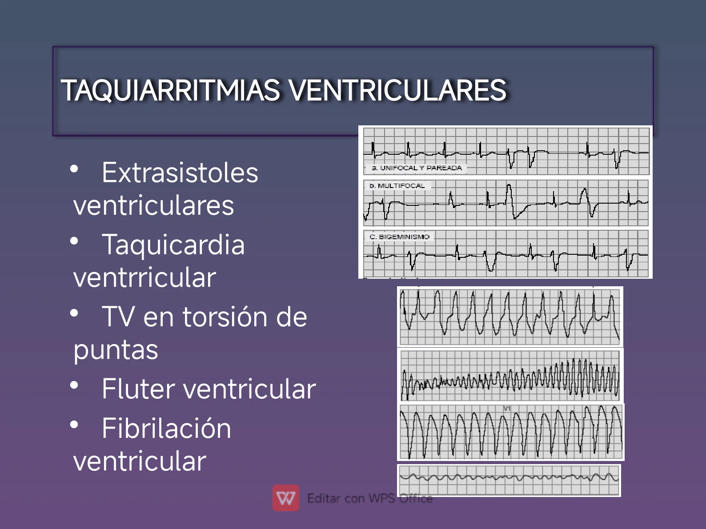</a><figcaption>Figura 5. Espectro ventricular. PDF de apoyo, p. 33. Compare complejos organizados y repetitivos con la actividad caótica de la FV; compruebe pulso y perfusión en todo trazado sospechoso.</figcaption></figure>

## 17. Taquicardia ventricular y diagnóstico del QRS ancho {#ventriculares}

La TV es una secuencia de al menos tres activaciones ventriculares rápidas, habitualmente >100/min. Se denomina **no sostenida** si termina espontáneamente antes de 30 segundos y **sostenida** si dura ≥30 segundos o requiere interrupción antes por compromiso hemodinámico. La clasificación depende también de la organización: monomorfa, polimorfa o bidireccional.

La **TV monomorfa** mantiene una forma de QRS relativamente uniforme. En cardiopatía isquémica crónica suele relacionarse con reentrada en cicatriz; en corazones sin enfermedad aparente pueden existir TV idiopáticas del tracto de salida o fasciculares. La **TV polimorfa** cambia de eje y morfología; puede aparecer por isquemia aguda o trastornos de repolarización. La **bidireccional** alterna ejes y obliga a considerar intoxicación digitálica o TV catecolaminérgica, entre otros contextos.

### TV frente a TSV con aberrancia

Los antecedentes de infarto o cardiopatía estructural aumentan la probabilidad de TV. La disociación AV, los latidos de captura y de fusión son hallazgos de gran valor. Su ausencia no descarta TV. Algunas TV conducen retrógradamente a la aurícula y muestran relación VA 1:1. Tener presión conservada no convierte el ritmo en supraventricular.

Un **latido de captura** aparece cuando un impulso supraventricular consigue activar el ventrículo durante la TV y produce un complejo relativamente normal. Un **latido de fusión** combina activación por el impulso supraventricular y por el circuito ventricular, generando una morfología intermedia. La interpretación exige compararlos con los complejos dominantes y descartar artefactos.

| Hallazgo | Por qué favorece TV | Límite |
|---|---|---|
| Disociación AV | Aurículas y ventrículos siguen ritmos independientes | Puede no ser visible; no toda disociación significa TV |
| Captura | Un impulso auricular penetra una activación ventricular independiente | Puede confundirse con cambios de conducción |
| Fusión | Dos frentes activan parte del ventrículo | Requiere comparar morfologías |
| Concordancia precordial | Todos los QRS predominantemente de la misma polaridad | La positiva también puede aparecer con preexcitación |
| Eje extremo o morfología atípica | Activación no compatible con bloqueo de rama habitual | No debe utilizarse como criterio único |
| QRS basal similar | Puede apoyar aberrancia preexistente | No excluye TV ni circuitos de reentrada entre ramas |

### Algoritmo de Brugada para taquicardia regular de QRS ancho

El algoritmo clásico pregunta secuencialmente si no existe RS en todas las precordiales, si el intervalo desde inicio de R al nadir de S supera 100 ms en alguna precordial, si existe disociación AV y si se cumplen criterios morfológicos de TV en V1–V2 y V6. Una respuesta positiva orienta a TV. Está diseñado para un contexto concreto; no debe aplicarse mecánicamente a cualquier taquicardia irregular, preexcitada o estimulada.

Su rendimiento depende del observador, el tipo de cardiopatía y los fármacos. La existencia de algoritmos no elimina la incertidumbre. Si una taquicardia ancha no puede clasificarse de forma segura, se maneja inicialmente como TV y se solicita apoyo experto, evitando verapamilo o diltiazem como ensayo diagnóstico.

<figure><a href="imagenes/arritmias/pdf-pagina-27.webp" target="_blank" rel="noopener">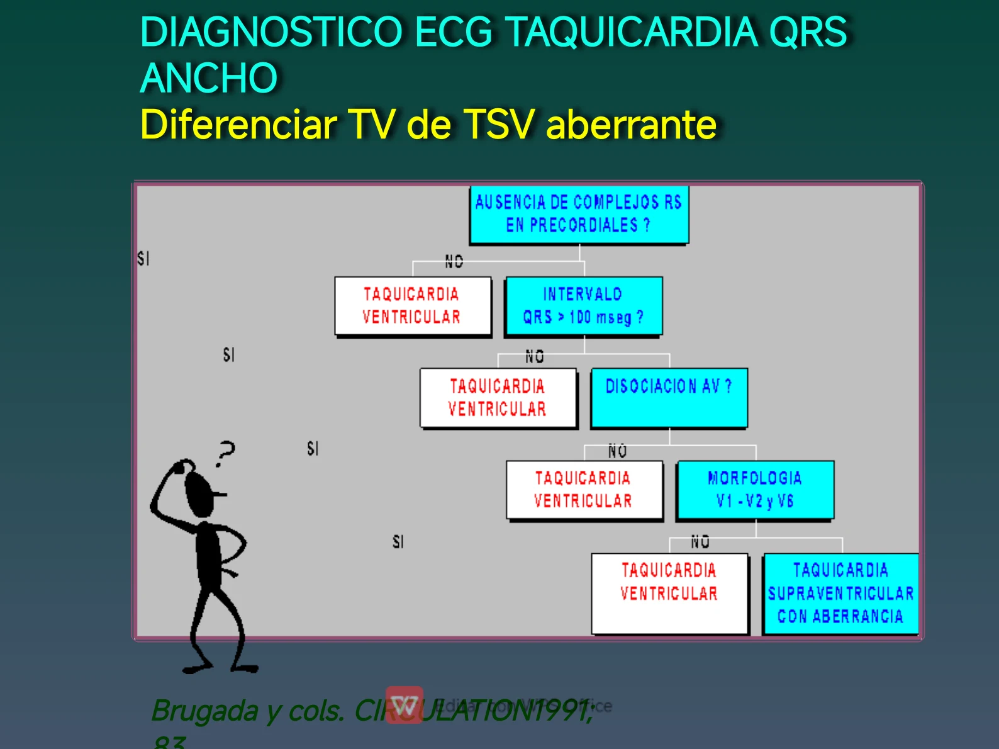</a><figcaption>Figura 6. Algoritmo diagnóstico presentado en el PDF, p. 27. Se estudia como herramienta para taquicardia regular ancha; no debe retrasar el tratamiento de un paciente inestable.</figcaption></figure>

### Aberrancia de fase 3, fase 4 y conducción oculta

La aberrancia dependiente de frecuencia puede producirse cuando un impulso llega a una rama todavía refractaria, especialmente después de cambios bruscos del ciclo. En FA, una secuencia largo-corto puede originar el fenómeno de Ashman, con QRS aberrante. La aberrancia de fase 4 se vincula a conducción anormal tras intervalos largos en tejido enfermo. La conducción retrógrada oculta puede mantener una rama refractaria sin generar una señal claramente identificable en superficie.

<figure><a href="imagenes/arritmias/pdf-pagina-37.webp" target="_blank" rel="noopener">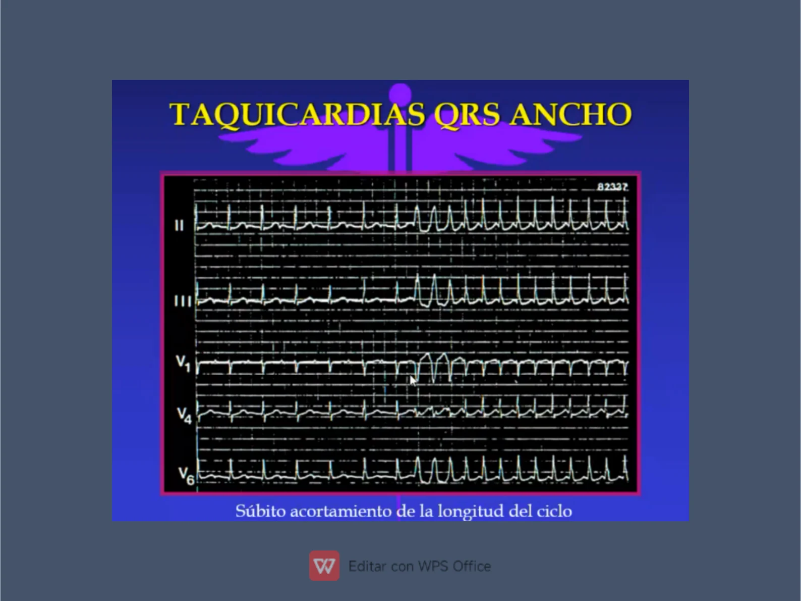</a><figcaption>Figura 7. Cambio brusco del ciclo y conducción aberrante. PDF de apoyo, p. 37. Observe el paso de complejos estrechos a anchos; la explicación exige valorar la secuencia y no solamente el ancho final.</figcaption></figure>

<figure><a href="imagenes/arritmias/pdf-pagina-38.webp" target="_blank" rel="noopener">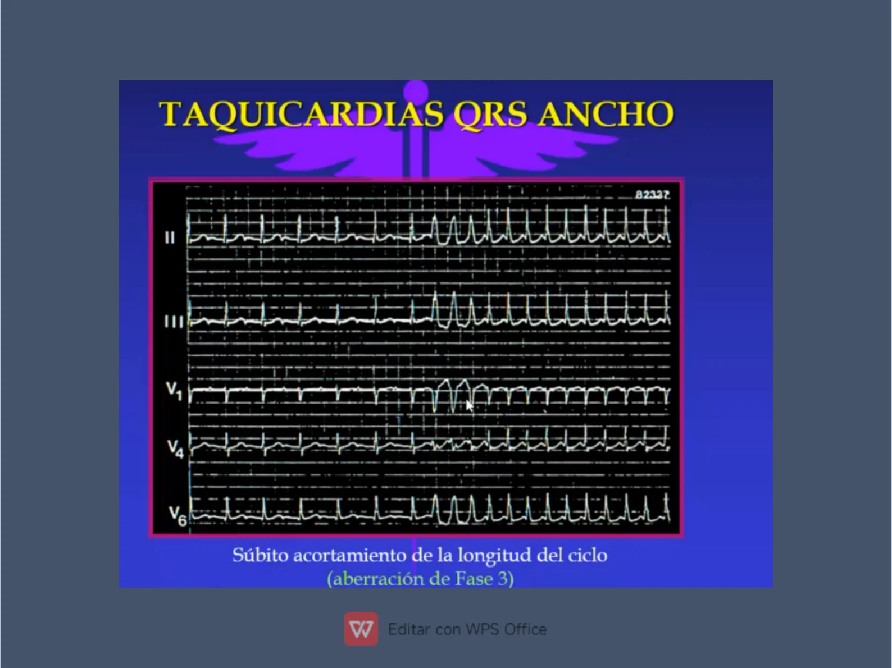</a><figcaption>Figura 8. Ejemplo complementario del PDF, p. 38. Compare el ritmo previo, los primeros complejos y la persistencia de la morfología para razonar sobre aberrancia y diagnósticos alternativos.</figcaption></figure>

## 18. QT largo, torsades, canalopatías y tormenta eléctrica {#torsades}

La torsades de pointes es una TV polimorfa asociada a QT prolongado, en la que la amplitud y el eje parecen girar alrededor de la línea de base. No toda TV polimorfa es torsades. Cuando el QT previo es normal y existe isquemia, la interpretación y el tratamiento preventivo son diferentes. El inicio tras una secuencia corto-largo-corto o una pausa apoya un mecanismo dependiente de repolarización.

Ante torsades se revisan fármacos, potasio, magnesio, función renal y causas de pausas. El QT puede ser congénito o adquirido. Los medicamentos que prolongan QT pueden interactuar, y el riesgo aumenta con bradicardia, insuficiencia cardíaca y trastornos electrolíticos. La TV polimorfa sostenida exige desfibrilación; el magnesio puede reducir recurrencias asociadas a QT largo, pero no reemplaza el choque. La estimulación para evitar pausas puede ser necesaria en casos seleccionados.

El síndrome de **Brugada** se relaciona con riesgo de arritmias ventriculares y un patrón tipo 1 característico en precordiales derechas; fiebre y algunos medicamentos pueden desenmascararlo. Un patrón sospechoso requiere diagnóstico diferencial y valoración especializada. El síndrome no se establece simplemente por mencionar elevación del ST en V1.

La **TV polimorfa catecolaminérgica** puede aparecer con ejercicio o emoción en personas con ECG basal y estructura aparentemente normales. Puede mostrar TV bidireccional o polimorfa. El síncope de esfuerzo y los antecedentes familiares orientan, y el estudio debe realizarse de forma controlada. La normalidad del ECG de reposo no descarta una enfermedad eléctrica hereditaria.

La **tormenta eléctrica** suele definirse como al menos tres episodios de arritmia ventricular sostenida en 24 horas que requieren terminación, separados entre sí. Obliga a buscar isquemia, descompensación, electrolitos, toxicidad y programación de dispositivos, además de controlar el tono simpático y considerar tratamiento especializado o ablación. No se resuelve únicamente repitiendo bolos sin analizar el sustrato.

## 19. Bradicardia, pausas y disfunción sinusal {#bradiarritmias}

La convención general denomina bradicardia a una frecuencia <60/min; los algoritmos de bradiarritmia sintomática utilizan frecuentemente <50/min como referencia. Una cifra baja no es enfermedad por sí misma. En deportistas o durante el sueño puede ser fisiológica; en un paciente con síncope, fármacos frenadores o daño del sistema de conducción adquiere otro significado.

La disfunción sinusal reúne bradicardia inapropiada, pausas, bloqueo de salida, incompetencia cronotrópica y síndrome taquicardia-bradicardia. La fibrosis relacionada con edad es un sustrato frecuente, pero deben revisarse isquemia, hipotiroidismo, alteraciones electrolíticas, apnea del sueño y medicamentos. En esta entidad, la correlación temporal entre síntomas y ritmo es fundamental para decidir estimulación permanente; no existe una duración universal de pausa o una frecuencia aislada que la indiquen automáticamente.

### Paro sinusal frente a bloqueo de salida sinoauricular

En el **paro sinusal**, el nodo no genera la descarga esperada; en el **bloqueo de salida**, la genera pero no alcanza adecuadamente el miocardio auricular. El ECG de superficie no registra directamente la descarga nodal. La ausencia de P obliga a inferir el fenómeno a partir del patrón temporal, no a afirmar que se ha visto el nodo detenerse.

En el bloqueo de salida tipo II, la pausa puede ser múltiplo del PP basal. En paro sinusal, habitualmente no conserva esa relación exacta. La arritmia sinusal y la falta de un registro largo reducen la precisión. Una P prematura bloqueada puede simular ambas situaciones; por eso se examina cuidadosamente la T anterior a la pausa.

<figure><a href="imagenes/arritmias/pdf-pagina-52.webp" target="_blank" rel="noopener">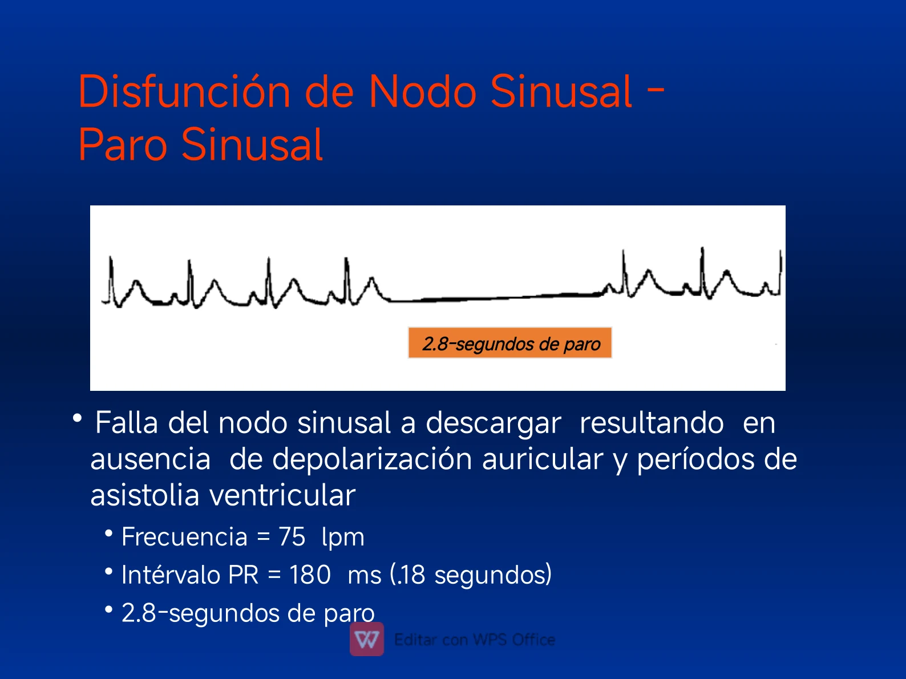</a><figcaption>Figura 9. Pausa sinusal. PDF de apoyo, p. 52. Compare PP antes y después y busque una P prematura oculta antes de concluir el mecanismo.</figcaption></figure>

<figure><a href="imagenes/arritmias/pdf-pagina-53.webp" target="_blank" rel="noopener">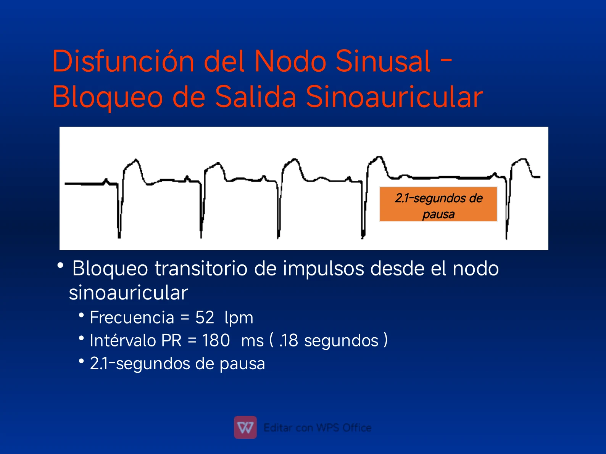</a><figcaption>Figura 10. Bloqueo de salida sinoauricular. PDF de apoyo, p. 53. La relación entre la pausa y el ciclo sinusal ayuda a diferenciarlo de otras causas de ausencia de P.</figcaption></figure>

### Incompetencia cronotrópica y síndrome taqui-bradi

La incompetencia cronotrópica es la incapacidad de aumentar la frecuencia de forma apropiada para la demanda. La interpretación de una prueba de esfuerzo considera esfuerzo logrado, edad, frecuencia basal y medicamentos. El criterio de no alcanzar un porcentaje de la frecuencia máxima predicha y el de no alcanzar un porcentaje de reserva cronotrópica son diferentes; no deben confundirse. La fórmula 220 menos edad es una estimación poblacional, no una medida exacta de cada paciente.

En el síndrome taqui-bradi alternan ritmos auriculares rápidos y bradicardia o pausas, especialmente al terminar una taquiarritmia. El tratamiento de la fase rápida puede agravar la lenta. La documentación de síntomas, los medicamentos y la necesidad de soporte con marcapasos condicionan la estrategia global.

<figure><a href="imagenes/arritmias/pdf-pagina-55.webp" target="_blank" rel="noopener">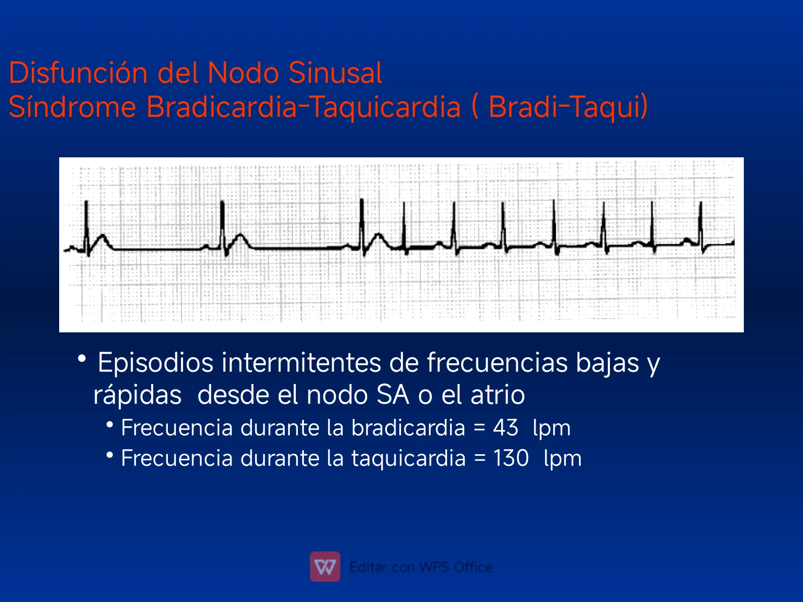</a><figcaption>Figura 11. Síndrome taqui-bradi. PDF de apoyo, p. 55. La transición y la pausa posterior pueden explicar síntomas que no aparecen durante la fase de frecuencia rápida.</figcaption></figure>

## 20. Bloqueos auriculoventriculares y de rama {#bloqueos}

### Primer grado: retraso, sin pérdida de complejos

Todas las P conducen, pero el PR supera 200 ms. Técnicamente es un retraso AV: no hay una P bloqueada. Puede localizarse en distintos niveles, aunque con frecuencia es nodal. Se revisan fármacos, tono vagal y cardiopatía. Un PR muy prolongado puede tener repercusión por mala coordinación AV; el diagnóstico electrocardiográfico por sí solo no establece necesidad de marcapasos.

### Segundo grado Mobitz I o Wenckebach

El patrón clásico muestra alargamiento progresivo del PR hasta una P no conducida; después se reinicia la secuencia con PR más corto. Suele ser nodal y puede aparecer con tono vagal elevado, pero un Wenckebach infranodal también existe. QRS estrecho y mejora con ejercicio apoyan localización nodal; no son pruebas absolutas.

### Segundo grado Mobitz II

Una P se bloquea inesperadamente con PR constante en los latidos conducidos antes y después, dentro de una frecuencia auricular estable y un patrón que permita demostrarlo. El PR puede ser normal o prolongado: **constante no significa normal**. Suele implicar His-Purkinje y conlleva riesgo de progresión.

### Bloqueo 2:1 y de alto grado

En 2:1, una P conduce y la siguiente no. No hay suficientes PR consecutivos para demostrar progresión o constancia diagnóstica de Mobitz: **no se clasifica automáticamente como Mobitz II**. La anchura del QRS, los cambios con frecuencia y el estudio especializado pueden ayudar a localizarlo. Un bloqueo de alto grado incluye dos o más P consecutivas no conducidas con alguna conducción preservada.

### Tercer grado o completo

No existe conducción AV efectiva: las aurículas y los ventrículos siguen marcapasos independientes. Los PP y RR pueden ser regulares por separado, mientras el PR aparente varía. Un escape de la unión puede ser relativamente estrecho y más rápido; un escape distal suele ser ancho y lento. Ninguno elimina la gravedad del bloqueo. Disociación AV es una descripción más amplia y también aparece cuando un ritmo ventricular compite con el sinusal; no equivale siempre a bloqueo completo.

| Trastorno | P conducidas | PR | Prioridad |
|---|---|---|---|
| Primer grado | Todas | Prolongado | Síntomas, fármacos y contexto |
| Mobitz I | Algunas se bloquean | Cambia en la secuencia clásica | Localización y repercusión |
| Mobitz II | Bloqueo intermitente | Constante en conducidas | Riesgo infranodal y estimulación |
| 2:1 | Alternancia | Un PR visible por ciclo | No asignar tipo sin más datos |
| Alto grado | Varias P consecutivas bloqueadas | Variable según mecanismo | Evaluación urgente |
| Completo | Ninguna conducción AV | Sin relación fija | Escape, perfusión y estimulación |

En Mobitz II adquirido, bloqueo avanzado o completo sin causa reversible o fisiológica, se recomienda estimulación permanente aunque no haya síntomas. La bradicardia nocturna aislada y las pausas sinusales sin correlación clínica no equivalen a esta indicación.

<figure><a href="imagenes/arritmias/pdf-pagina-60.webp" target="_blank" rel="noopener">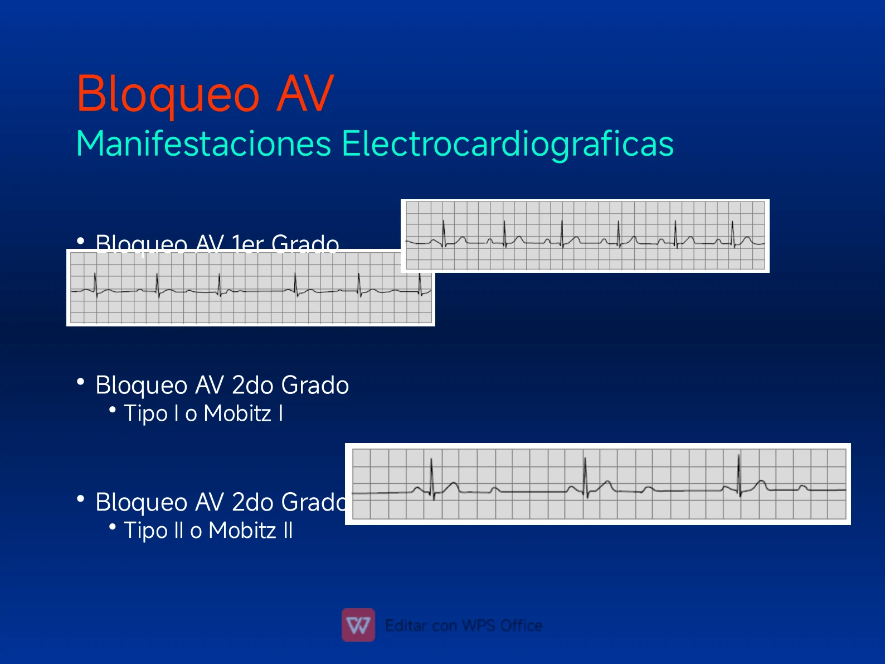</a><figcaption>Figura 12. PDF de apoyo, p. 60. <strong>Aclaración:</strong> la tira inferior rotulada como Mobitz II muestra conducción 2:1; ese patrón aislado no permite establecer Mobitz I frente a II. El PR constante de un único latido conducido no basta.</figcaption></figure>

<figure><a href="imagenes/arritmias/pdf-pagina-61.webp" target="_blank" rel="noopener">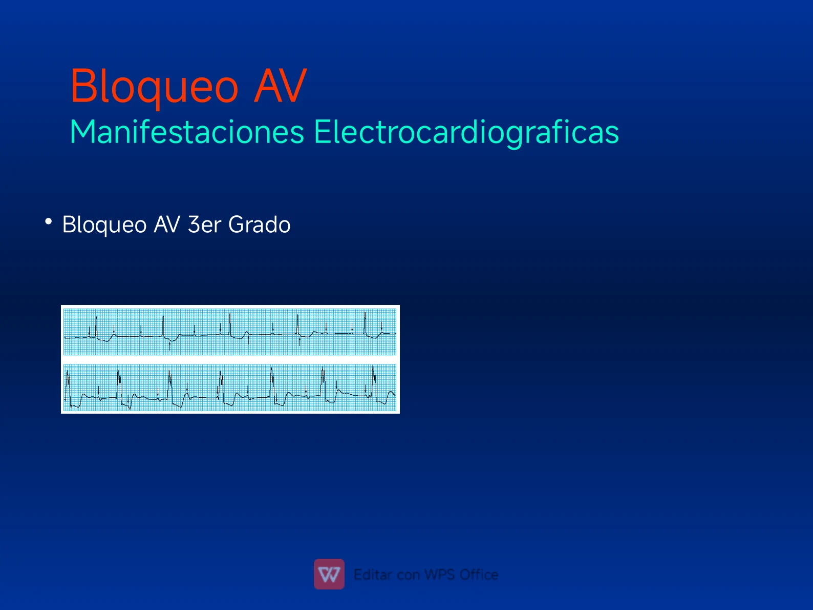</a><figcaption>Figura 13. Bloqueo completo. PDF de apoyo, p. 61. Siga las P a través de QRS y T para reconocer la independencia auriculoventricular.</figcaption></figure>

### Bifascicular, «trifascicular» y enfermedad de conducción

El bloqueo de rama derecha asociado a hemibloqueo anterior o posterior izquierdo es un patrón bifascicular. Agregar PR prolongado no demuestra que el retraso se encuentre en el tercer fascículo: puede localizarse en el nodo AV. Es preferible describir los hallazgos y el nivel probable a utilizar «trifascicular» como conclusión automática. Síncope, bloqueo de rama alternante o evidencia de enfermedad infranodal justifican evaluación especializada.

Las causas incluyen fibrosis degenerativa, isquemia, fármacos, miocarditis, infiltración, enfermedad de Chagas y alteraciones electrolíticas. Un bloqueo nuevo en un paciente con endocarditis puede sugerir extensión perivalvular; en un paciente joven con bloqueo avanzado inexplicado se investiga enfermedad inflamatoria o infiltrativa según contexto. Corregir una causa reversible y vigilar la persistencia son pasos distintos de asumir que todo bloqueo es degenerativo.

## 21. Fármacos antiarrítmicos: comprender antes de memorizar {#farmacos}

La clasificación de Vaughan Williams agrupa efectos predominantes, pero algunos fármacos actúan sobre varias corrientes y receptores. La selección depende del mecanismo, función ventricular, isquemia, QT, conducción basal, función renal o hepática e interacciones. Suprimir un hallazgo del ECG no demuestra mejorar supervivencia; un antiarrítmico puede producir una arritmia nueva, denominada proarritmia.

| Clase | Ejemplos | Efecto predominante | Riesgo que debe reconocerse |
|---|---|---|---|
| IA | Procainamida, quinidina, disopiramida | Bloqueo de Na⁺ y prolongación de repolarización | QT largo, torsades, hipotensión; efecto inotrópico según agente |
| IB | Lidocaína, mexiletina | Bloqueo de Na⁺ con preferencias por tejido y estado del canal | Toxicidad neurológica; acumulación según metabolismo |
| IC | Flecainida, propafenona | Marcado enlentecimiento de conducción | QRS ancho y proarritmia en cardiopatía estructural o isquémica |
| II | Betabloqueadores | Reducción de efectos adrenérgicos | Bradicardia, bloqueo, hipotensión; selección según comorbilidades |
| III | Amiodarona, sotalol, dofetilida, ibutilida | Prolongación de repolarización, con efectos adicionales variables | QT largo; toxicidad y eliminación particulares |
| IV | Verapamilo, diltiazem | Bloqueo de Ca²⁺ y conducción nodal | Hipotensión, bloqueo AV y empeoramiento de disfunción sistólica |
| Otros | Adenosina, digoxina, atropina | Efectos nodales o autonómicos específicos | No son intercambiables ni sirven para cualquier ritmo |

### Particularidades de mayor utilidad clínica

**Adenosina:** su acción breve facilita interrumpir AVNRT y determinadas AVRT. Se administra como bolo rápido por acceso adecuado seguido de lavado, mientras se registra el ECG. Puede generar pausa transitoria, rubor, disnea o molestias torácicas. Bloqueo AV avanzado sin soporte, ciertas situaciones respiratorias y las interacciones requieren evaluación. No se utiliza como ensayo en una taquicardia ancha irregular o polimorfa.

**Amiodarona:** combina efectos sobre varias corrientes. En tratamientos prolongados se vigilan tiroides, hígado, pulmón y otras toxicidades, además de bradicardia e interacciones. La administración IV puede producir hipotensión. La dosis para TV con pulso no es la misma que el bolo del paro. Su menor propensión relativa a torsades frente a algunos agentes no significa ausencia de riesgo. No se usa en FA preexcitada.

**Flecainida y propafenona:** enlentecen la conducción y pueden ensanchar QRS de forma dependiente de frecuencia. No deben extrapolarse a pacientes con cardiopatía isquémica o estructural significativa. La respuesta ventricular 1:1 de un flutter organizado por estos agentes es una complicación reconocida; la estrategia requiere selección y supervisión especializada.

**Sotalol:** combina betabloqueo y prolongación de repolarización; QT, frecuencia y eliminación renal son relevantes. **Digoxina:** disminuye la conducción nodal principalmente mediante influencia vagal; su margen terapéutico, función renal, potasio e interacciones importan. Una intoxicación puede producir simultáneamente automatismo aumentado y bloqueo, por ejemplo taquicardia auricular con bloqueo AV.

**Verapamilo y diltiazem:** actúan sobre el nodo AV, pero no son una solución universal para QRS ancho. **Atropina:** reduce el efecto vagal; puede ser útil en bradicardia nodal, pero su eficacia es limitada si el bloqueo se encuentra distalmente. La falta de respuesta no debe retrasar soporte con estimulación cuando está indicado.

### Interacciones y eliminación

Un medicamento eliminado por riñón puede acumularse en lesión renal aguda. Un inhibidor metabólico puede elevar la concentración de otro; la amiodarona puede aumentar el efecto de warfarina y los niveles de digoxina. Asociar varios agentes frenadores incrementa el riesgo de bloqueo o bradicardia. Un fármaco que prolonga QT junto con hipokalemia exige más vigilancia que cualquiera de ellos por separado.

La tabla histórica del PDF enumera fármacos hoy menos utilizados o cuya disponibilidad es variable. Para decidir una dosis se consulta el esquema vigente, la presentación disponible y el protocolo institucional; no se convierte una lámina histórica de ajustes en una orden terapéutica universal.

## 22. Esquemas iniciales en adultos: qué dosis corresponde a qué situación {#dosis}

Estos esquemas pertenecen al manejo de adultos con monitorización y capacidad de reanimación. La elección precede a la dosis: primero hay que identificar pulso, estabilidad, regularidad, anchura del QRS y contraindicaciones.

| Situación | Esquema inicial de referencia | Precisión |
|---|---|---|
| Taquicardia regular apropiada para adenosina | 6 mg IV rápidos; si precisa, 12 mg | Lavado inmediato; no FA preexcitada ni ritmo ancho irregular |
| TV monomorfa estable seleccionada: amiodarona | 150 mg IV en 10 min; después 1 mg/min durante las primeras 6 h | No es el bolo de 300 mg del paro |
| Taquicardia ancha estable seleccionada: procainamida | 20–50 mg/min, máximo 17 mg/kg; mantenimiento 1–4 mg/min | Detener por hipotensión, supresión o aumento de QRS >50%; evitar en QT prolongado o insuficiencia cardíaca |

Esquemas iniciales de taquiarritmia. No se combinan de forma automática y la disponibilidad de procainamida varía.

| Situación | Esquema de referencia | Precisión |
|---|---|---|
| Bradicardia con compromiso y atropina apropiada | 1 mg IV; repetir cada 3–5 min, máximo 3 mg | Preparar estimulación si bloqueo avanzado o respuesta insuficiente |
| Soporte de bradicardia: dopamina | 5–20 µg/kg/min | Titular según respuesta, no confundir con µg/min |
| Soporte de bradicardia: adrenalina | 2–10 µg/min | Infusión; no es la dosis de paro |

Esquemas iniciales de bradicardia. Si la atropina falla, se considera estimulación transcutánea y/o infusión, con valoración de estimulación transvenosa.

| Situación | Esquema de referencia | Precisión |
|---|---|---|
| Paro: adrenalina | 1 mg IV/IO cada 3–5 min | La secuencia depende del ritmo desfibrilable o no desfibrilable |
| FV/TV sin pulso refractaria: amiodarona | 300 mg IV/IO; segunda dosis 150 mg | Se añade al algoritmo; no sustituye RCP ni desfibrilación |
| Alternativa: lidocaína | Inicial 1–1,5 mg/kg; segunda 0,5–0,75 mg/kg | Selección dentro del algoritmo de paro |

Esquemas iniciales de paro. Se minimizan interrupciones de compresiones y se investigan causas reversibles.

La diferencia entre **mg**, **µg**, **µg/kg/min** y **µg/min** tiene consecuencias reales. Además, el mismo fármaco puede utilizarse en bolo, carga lenta o infusión. Una prescripción debe especificar concentración, vía, velocidad y objetivo de titulación. El electrocardiograma posterior y la respuesta clínica forman parte del tratamiento.

<strong>BADBEAR.MED FIJA:</strong> antes de administrar un antiarrítmico, diga en voz alta qué ritmo está tratando y si el paciente tiene pulso. Evita confundir dosis de paro con dosis para una taquicardia perfundida.

## 23. Cardioversión y desfibrilación {#electricidad}

La **cardioversión sincronizada** entrega energía vinculada al QRS para reducir el riesgo de estimular durante una fase vulnerable de la repolarización. Se verifica que el equipo marque correctamente los complejos antes de descargar. Después de cada descarga puede ser necesario reactivar la sincronización. Si la sincronización se demora y el paciente está en estado crítico, la prioridad es una descarga oportuna siguiendo el protocolo.

La **desfibrilación** es una descarga no sincronizada, utilizada en FV, TV sin pulso y TV polimorfa sostenida. En la polimorfa, la variación de complejos impide confiar en una sincronización adecuada. No se aplica a asistolia ni a actividad eléctrica sin pulso como intento de convertirlas en un ritmo perfundido.

| Ritmo en un adulto cuando la descarga está indicada | Energía inicial de referencia |
|---|---|
| Fibrilación auricular | Cardioversión sincronizada, 200 J |
| Flutter auricular | Cardioversión sincronizada, 200 J |
| Taquicardia de complejo estrecho | Cardioversión sincronizada, 100 J |
| TV monomorfa con pulso | Cardioversión sincronizada, 100 J |
| TV polimorfa | Choque no sincronizado de alta energía |

La energía debe concordar con el dispositivo y sus recomendaciones; puede escalarse si falla. Los valores de flutter difieren de esquemas antiguos de baja energía. Sedación, oxigenación y equipo de vía aérea se preparan cuando es factible, sin retrasar una intervención urgente.

En una cardioversión electiva de FA o flutter, anticoagulación e investigación de trombo siguen siendo necesarias según duración y riesgo. La energía restaura un patrón eléctrico, pero no elimina inmediatamente el aturdimiento auricular ni una fuente embólica. Tampoco garantiza que el ritmo se mantenga si persisten desencadenantes o remodelado.

## 24. Estimulación temporal y marcapasos permanente {#marcapasos}

El objetivo de la estimulación es lograr una frecuencia y sincronía suficientes para perfundir. La **transcutánea** utiliza parches externos y puede iniciarse rápidamente. Se ajustan frecuencia y corriente hasta obtener captura; en pacientes conscientes puede resultar dolorosa y requiere analgesia o sedación apropiada. No se confirma éxito mirando solo espigas en el monitor.

La **captura eléctrica** significa que el estímulo produce despolarización ventricular. La **captura mecánica** exige demostrar contracción efectiva: pulso, presión o señal hemodinámica coherente con cada complejo. Las contracciones musculares generadas por el equipo pueden confundir la palpación. El soporte debe vigilarse continuamente porque el umbral puede cambiar.

La **estimulación transvenosa** utiliza un electrodo intracardíaco temporal cuando se necesita soporte más estable o la respuesta transcutánea no es suficiente. Implica riesgos de desplazamiento, infección, arritmia, perforación y complicaciones vasculares. Constituye un puente mientras se corrige una causa o se decide el sistema permanente.

Un marcapasos permanente contiene generador y, según el sistema, uno o más electrodos. Detecta actividad propia y estimula cuando se cumplen condiciones programadas. La elección unicameral, bicameral o de una estrategia de activación más fisiológica depende del ritmo auricular, la conducción, la función ventricular y la carga prevista de estimulación. No existe un modo óptimo para todos.

| Código | Qué informa |
|---|---|
| Primera letra | Cámara estimulada: A aurícula, V ventrículo, D ambas |
| Segunda letra | Cámara detectada |
| Tercera letra | Respuesta: inhibición, disparo o ambas |
| R adicional | Adaptación de frecuencia mediante sensores |

**VVI** estimula y detecta en ventrículo e inhibe al detectar actividad propia; **DDD** coordina detección y estimulación auricular y ventricular según programación. Un modo que preserva sincronía AV puede ser útil cuando existe actividad auricular organizada; una FA permanente modifica la selección. La indicación de implantar y la programación adecuada son decisiones diferentes.

La **falla de captura** muestra estímulos sin el complejo esperado; la **falla de sensado** puede hacer que el dispositivo estimule pese a actividad propia o inhiba por señales inapropiadas. Una espiga pequeña puede no verse bien en una derivación. El análisis considera ECG, síntomas, batería, electrodos y revisión del dispositivo.

## 25. Estudio electrofisiológico y ablación {#electrofisiologia}

El estudio electrofisiológico registra activación desde catéteres intracardíacos y evalúa la respuesta a estimulación programada. No consiste simplemente en obtener un ECG más largo: permite medir conducción y refractariedad, inducir una arritmia, reconocer su circuito y localizar una estructura susceptible de tratamiento.

Los electrogramas pueden identificar señales auriculares (**A**), del His (**H**) y ventriculares (**V**). El intervalo **AH** informa principalmente sobre conducción nodal AV; **HV**, sobre conducción His-Purkinje. Los valores se interpretan con las condiciones del estudio y la anatomía. Una alteración distal tiene implicaciones distintas a un retraso nodal. La posición de catéteres en aurícula, His, ventrículo y seno coronario ayuda a reconstruir secuencias.

La estimulación con ciclos y extraestímulos puede revelar doble fisiología nodal, conducción por una vía accesoria o inducibilidad de determinadas taquicardias. El *entrainment* y las respuestas a maniobras especializadas permiten analizar circuitos de reentrada. La inducción es una herramienta diagnóstica en pacientes seleccionados; un resultado negativo no elimina cualquier posibilidad de arritmia futura.

<figure><a href="imagenes/arritmias/pdf-pagina-67.webp" target="_blank" rel="noopener">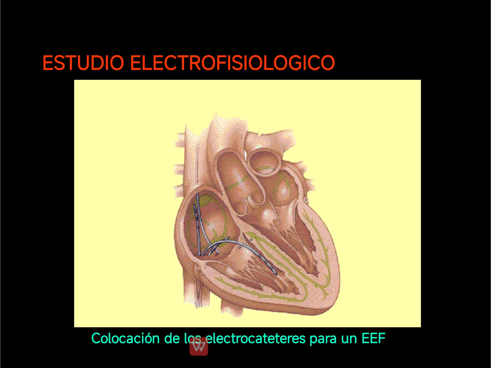</a><figcaption>Figura 14. Catéteres y puntos de registro. PDF de apoyo, p. 67. Su distribución permite comparar la secuencia aurícula–His–ventrículo y el retorno retrógrado.</figcaption></figure>

<figure><a href="imagenes/arritmias/pdf-pagina-69.webp" target="_blank" rel="noopener">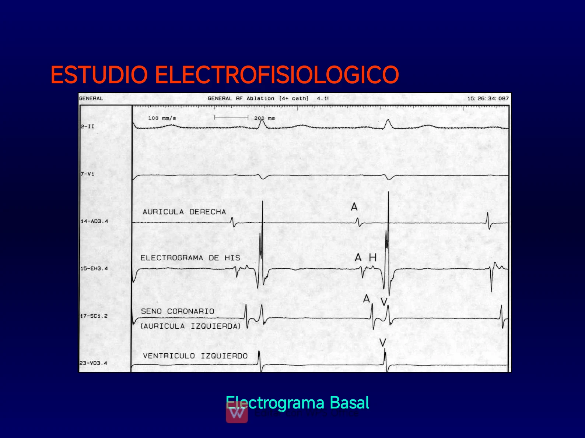</a><figcaption>Figura 15. Electrogramas intracardíacos. PDF de apoyo, p. 69. Se analizan tiempos y secuencias; la información debe relacionarse con posición de catéteres y ECG de superficie.</figcaption></figure>

La **ablación por radiofrecuencia** produce lesión térmica controlada en una región crítica; la **crioablación** utiliza enfriamiento. En FA pueden utilizarse tecnologías adicionales, incluida ablación por campo pulsado en centros y situaciones adecuados. La elección depende del objetivo, el equipo y la experiencia. Los catéteres y el mapeo tridimensional permiten identificar focos y circuitos y reducir dependencia de fluoroscopia en determinados procedimientos.

El objetivo cambia con la arritmia: vía lenta en AVNRT, vía accesoria en AVRT, istmo cavotricuspídeo en flutter típico, regiones relacionadas con venas pulmonares en FA, o canales de cicatriz en TV. «Ablacionar el corazón» es una descripción demasiado imprecisa para comprender el procedimiento.

Los riesgos incluyen complicaciones vasculares, taponamiento, tromboembolia, lesión del sistema AV y otros dependientes de la zona tratada. Éxito y recurrencia varían según mecanismo, cardiopatía y técnica. Una tasa histórica única de fracaso del 15–30% no describe todas las ablaciones actuales. Algunas taquicardias por reentrada permiten ofrecer ablación como opción inicial tras explicar beneficios y riesgos; no es necesario asumir que siempre debe ser el último recurso.

## 26. Desfibrilador implantable y prevención de muerte súbita {#desfibrilador}

El desfibrilador automático implantable, **DAI**, reconoce determinadas arritmias ventriculares y puede tratarlas mediante estimulación antitaquicardia o choque. Algunos sistemas también ofrecen estimulación por bradicardia; sus capacidades dependen del tipo de dispositivo. Un DAI no elimina la cardiopatía ni evita toda arritmia: reduce el riesgo de muerte por ritmos tratables en pacientes seleccionados.

La **estimulación antitaquicardia** entrega secuencias rápidas que pueden penetrar e interrumpir una reentrada ventricular, con menor molestia que una descarga. Si no resulta efectiva o el ritmo exige choque, el dispositivo aplica la terapia programada. Un choque inapropiado puede resultar de reconocimiento de una arritmia supraventricular, ruido o problemas de sensado; la revisión no consiste únicamente en confirmar que «el aparato descargó».

La **prevención secundaria** considera a sobrevivientes de FV o TV sostenida peligrosa cuando no existe una causa completamente reversible que explique el evento. La **primaria** busca prevenir un primer evento fatal en grupos de riesgo definidos. Fracción de eyección, enfermedad causal, evolución tras tratamiento, cicatriz, genética, comorbilidades y expectativa funcional influyen. No se indica un DAI por cualquier extrasístole ni por una cifra de frecuencia.

El DAI y la ablación pueden ser complementarios: uno termina episodios y la otra reduce un circuito responsable. En TV recurrente con cardiopatía isquémica y terapias del DAI pese a tratamiento, la ablación puede preferirse a intensificar fármacos en escenarios definidos. La decisión requiere valoración especializada.

<figure><a href="imagenes/arritmias/pdf-pagina-92.webp" target="_blank" rel="noopener">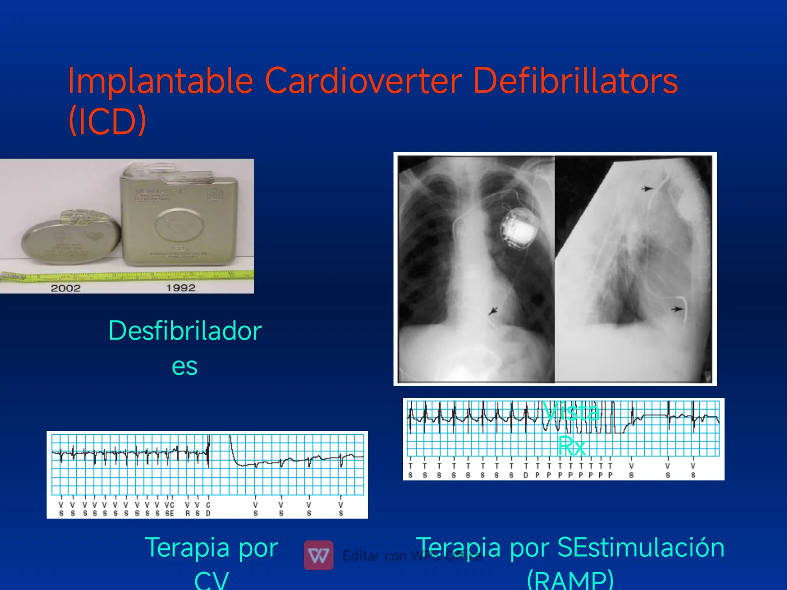</a><figcaption>Figura 16. DAI y terapias. PDF de apoyo, p. 92. El dispositivo puede utilizar estimulación antitaquicardia o choque según detección y programación; la indicación depende del riesgo clínico global.</figcaption></figure>

## 27. Casos clínicos razonados {#casos}

Los siguientes escenarios son **material original de entrenamiento**. Se estudia el razonamiento; no se presentan como preguntas históricas de un ENAM específico.

Caso 1 · Taquicardia estrecha de inicio brusco

Paciente de 24 años con palpitaciones súbitas, frecuencia de 190/min, presión conservada, QRS estrecho y sin P claramente visible. La estabilidad permite caracterizar el ritmo y buscar AVNRT o AVRT; no autoriza concluir que es ansiedad. El comienzo brusco favorece reentrada. Una terminación con adenosina apoya un circuito dependiente del nodo AV, pero se revisa el ECG basal y el registro durante la respuesta para precisar el mecanismo.

Caso 2 · Frecuencia ventricular cercana a 150/min

Paciente con taquicardia regular estrecha a 148/min. En II y V1 se identifican dos activaciones auriculares por ciclo ventricular. El flutter 2:1 explica por qué una onda queda escondida en el QRS o la T. Un bloqueo nodal transitorio puede revelar las ondas sin terminar el circuito. El estudio del riesgo tromboembólico y del sustrato acompaña al control del episodio.

Caso 3 · Taquicardia ancha con presión normal

Persona con infarto antiguo, QRS ancho regular a 160/min y presión de 115/70 mmHg. La presión actual no descarta TV. El antecedente de cicatriz eleva su probabilidad; captura, fusión o disociación AV la apoyarían. Si persiste incertidumbre, se maneja como TV en entorno monitorizado y se evita verapamilo como prueba. Si aparece deterioro atribuible a la arritmia, cambia la prioridad a terapia eléctrica.

Caso 4 · Ritmo ancho, irregular y extremadamente rápido

Paciente joven con episodios previos y ECG basal con onda delta; ahora presenta frecuencia muy elevada, irregularidad y QRS variables. La FA preexcitada es una posibilidad crítica. No se aplica el tratamiento nodal habitual de FA. Se evalúa estabilidad para cardioversión o estrategia especializada que actúe sobre la vía accesoria. Tras el episodio, la vía requiere estratificación y consideración de ablación.

Caso 5 · Ritmo irregular con varias ondas P

Paciente con enfermedad pulmonar descompensada, frecuencia de 120/min y al menos tres morfologías de P, con línea isoeléctrica entre ellas. Corresponde a un patrón compatible con taquicardia auricular multifocal, no a FA por la sola irregularidad. Hipoxia, electrolitos y fármacos pueden sostener el mecanismo. Corregir la enfermedad de base es una parte central del tratamiento.

Caso 6 · Síncope y conducción AV 2:1

Paciente con síncope, frecuencia auricular de 80/min y ventricular de 40/min; una P conduce y la siguiente no. El diagnóstico inicial es bloqueo AV 2:1. No se etiqueta Mobitz II solo porque el PR del único latido conducido sea constante. QRS ancho, síntomas y sospecha infranodal aumentan preocupación y justifican vigilancia y evaluación para estimulación.

Caso 7 · Pausa después de terminar una FA

Una persona presenta presíncope inmediatamente después de cesar una taquiarritmia auricular; el monitor documenta una pausa prolongada coincidente con el síntoma. La correlación temporal apoya un síndrome taqui-bradi. Se revisan fármacos y causas reversibles antes de decidir soporte permanente y estrategia para la fase rápida. No se interpreta la pausa separada del momento del síntoma.

Caso 8 · TV polimorfa después de una pausa

Paciente con medicamentos que prolongan QT, potasio bajo y QTc de 540 ms desarrolla una TV polimorfa tras una pausa. El contexto orienta a torsades. Si es sostenida, la prioridad es descarga no sincronizada; para prevenir recurrencias se retiran factores causales y se corrigen electrolitos, con magnesio y otras medidas según evolución. Administrar otro fármaco que prolonga QT puede agravar el mecanismo.

Caso 9 · Pausa aparente por extrasístole auricular bloqueada

En una tira, parece faltar una P y un QRS; al ampliar la T previa se descubre una deformación por una P adelantada. La activación auricular prematura llegó a un nodo AV refractario y no condujo. El hallazgo cambia la interpretación de «paro sinusal» a ectopia auricular bloqueada. La lectura debe incluir lo que ocurre antes de la pausa.

Caso 10 · Espigas de marcapasos sin mejoría clínica

El monitor muestra estímulos durante estimulación transcutánea, pero no existen QRS capturados de forma consistente ni presión adecuada. Las espigas aisladas no demuestran eficacia. Se revisa captura eléctrica, conexión, intensidad y captura mecánica; el movimiento muscular puede confundir la palpación. La perfusión y el registro permiten decidir ajustes y necesidad de otro soporte.

## 28. Errores frecuentes y actualizaciones del material docente {#errores}

| Interpretación incompleta o peligrosa | Forma correcta de estudiarla |
|---|---|
| «QRS estrecho siempre es supraventricular» | Es una orientación fuerte, con excepciones; integrar mecanismo y contexto |
| «La presión está normal, entonces no es TV» | Una TV puede estar inicialmente bien tolerada |
| «2:1 es Mobitz II» | El patrón aislado no permite clasificar Mobitz I/II |
| «Mobitz II requiere PR normal» | Requiere PR constante en la secuencia apropiada; puede estar prolongado |
| «Mobitz II durante el sueño es una variante normal» | No se acepta como regla de benignidad; diferenciar bloqueo vagal y enfermedad infranodal |
| «Pausa ≥3 segundos siempre indica marcapasos» | En disfunción sinusal importa correlación clínica y causa; no hay umbral universal |
| «Una cantidad fija de extrasístoles diarias define normalidad» | Importan carga, síntomas, complejidad y cardiopatía |
| «La adenosina que terminó el ritmo demuestra TSV» | Algunas TV idiopáticas responden; revisar el registro completo |
| «Todo flutter se cardioverte inicialmente con 50 J» | La referencia inicial es 200 J; verificar equipo y protocolo |
| «La misma dosis de amiodarona sirve con y sin pulso» | Carga lenta para situaciones con pulso y bolos de paro son distintos |
| «Amiodarona sirve para cualquier FA» | En FA preexcitada está contraindicada |
| «La ablación siempre requiere fracaso de muchos fármacos» | Puede ser una opción inicial en arritmias seleccionadas |
| «Toda ablación tiene una tasa de fracaso de 15–30%» | Resultados dependen de arritmia, técnica y sustrato |
| «La radiofrecuencia nunca necesita anestesia general» | Sedación y anestesia dependen del procedimiento y paciente |
| «PR largo más bifascicular demuestra daño de tres fascículos» | El retraso puede ser nodal; describir y localizar |

El PDF original se conserva como material docente. Estas precisiones permiten estudiar sus ilustraciones sin convertir afirmaciones históricas o simplificadas en reglas universales. Los cuadros de urgencia integran los esquemas de manejo explicados en este capítulo.

## 29. Glosario para leer electrofisiología {#glosario}

| Término | Significado práctico |
|---|---|
| Automatismo | Generación espontánea de un impulso |
| Actividad desencadenada | Impulso dependiente de una posdespolarización tras actividad previa |
| Reentrada | Reactivación repetida de tejido por una onda que recircula |
| Refractariedad | Capacidad temporal limitada de responder a un estímulo |
| Decremental | Conducción que se enlentece ante cambios de frecuencia o estímulo |
| Escape | Activación de un marcapasos subsidiario ante falta del dominante |
| Ectopia | Activación desde un foco diferente al dominante esperado |
| Acoplamiento | Tiempo entre latido dominante y complejo prematuro |
| Aberrancia | Activación ventricular alterada por conducción anormal del impulso supraventricular |
| Preexcitación | Activación ventricular anticipada por una conexión adicional |
| Disociación AV | Actividad auricular y ventricular sin una relación fija de dependencia |
| Captura y fusión | Hallazgos que pueden evidenciar activación ventricular independiente |
| AH y HV | Intervalos intracardíacos para estudiar conducción nodal y His-Purkinje |
| Proarritmia | Arritmia causada o agravada por un tratamiento |
| Ablación | Lesión dirigida a un foco o segmento crítico del circuito |
| DAI | Dispositivo para reconocer y tratar determinadas arritmias ventriculares |
| Carga arrítmica | Proporción o tiempo de actividad anormal durante el registro |
| RP | Intervalo desde activación ventricular a la P siguiente |
| Conducción oculta | Penetración de un impulso que cambia refractariedad sin una respuesta visible completa |
| Remodelado | Cambios eléctricos o estructurales que modifican el sustrato |

## 30. BADBEAR.MED FIJA: integración final {#fijas}

<strong>BADBEAR.MED FIJA:</strong> primero pulso y perfusión; después mecanismo y nombre exacto. Un algoritmo no debe retrasar una intervención urgente.

- Una taquicardia sinusal puede ser compensadora: corregir la causa es parte del tratamiento.
- En una taquicardia regular estrecha, busque P, relación RP/PR e inicio brusco frente a gradual.
- Frecuencia cercana a 150/min obliga a buscar flutter 2:1, sin convertir la cifra en diagnóstico.
- Irregularidad con tres o más morfologías de P orienta a taquicardia auricular multifocal.
- QRS ancho e incertidumbre: proteger frente a TV; presión conservada no la excluye.
- Captura, fusión y disociación AV tienen gran valor, pero su ausencia no descarta TV.
- FA preexcitada cambia la conducta: evitar fármacos bloqueadores nodales AV.
- TV polimorfa y torsades no son sinónimos: el QT previo modifica la interpretación.
- En disfunción sinusal, relacionar síntomas con el ritmo; en ciertos bloqueos avanzados, el riesgo justifica estimulación aunque no haya síntomas.
- Un bloqueo 2:1 se describe como tal hasta obtener datos suficientes para localizarlo y clasificarlo.
- Marcapasos, DAI y ablación resuelven problemas diferentes y pueden complementarse.
- Una intervención exitosa sobre el ritmo no sustituye tratar cardiopatía, desencadenantes y riesgo tromboembólico.

## 31. Material extra de BADBEAR.MED {#referencias}

### Material extra del curso

**Arritmias cardíacas · Material extra.** PDF de apoyo de 92 páginas, 10,59 MB. Los números de página de las figuras permiten localizar cada trazado dentro del archivo. El desarrollo académico de este capítulo está a cargo de **BADBEAR.MED**.

<a class="primary" href="pdf/material-extra/arritmias-cardiacas.pdf" target="_blank" rel="noopener">Abrir material extra · 92 páginas</a><a href="pdf/material-extra/arritmias-cardiacas.pdf" download="arritmias-cardiacas.pdf">Descargar PDF de apoyo</a><button type="button" data-print>Imprimir desarrollo</button>

