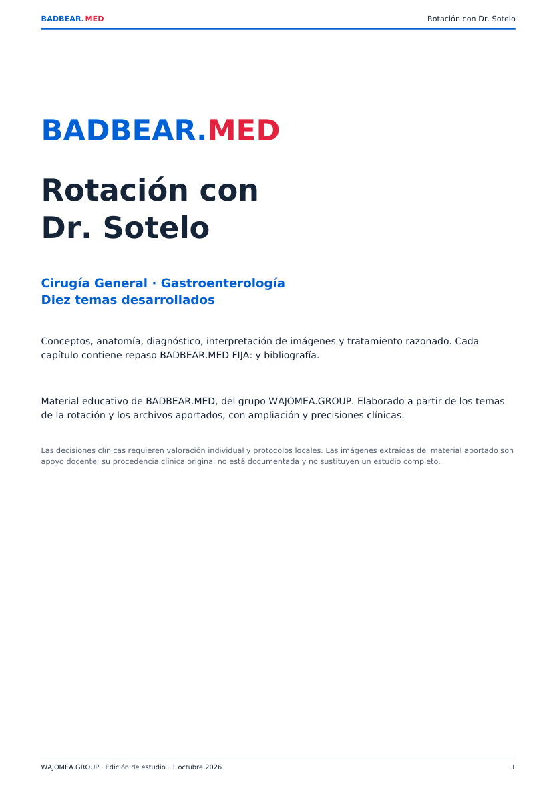

# Revisión de la edición de Sotelo · 1 octubre 2026

Contenido: diez capítulos, más de 13 000 palabras en las fuentes Markdown, manual de 43 páginas, seis imágenes y los dos materiales aportados. Commit del contenido: `8d0f1b72b794a45aa5751e29d15e4a8073095fd3`.

## Verificaciones realizadas

- Generación de diez páginas HTML, con fuentes editables y bibliografía.
- Enlaces internos, identificadores y rutas de los recursos comprobados contra archivos locales y árbol del repositorio: sin rutas ausentes ni identificadores duplicados.
- Manual con diez entradas en el índice y diez marcadores; revisión visual de todas las páginas en hojas de contacto y de páginas con figuras en tamaño ampliado. Textos y figuras dentro del área de la página.
- PDF de consulta: 15 páginas; comparación de todos los píxeles renderizados con el PDF aportado, sin diferencias.
- PowerPoint original preservado byte por byte; PDF original reconstruido desde sus dos partes y verificado por SHA-256.
- Todos los archivos del commit comprobados por tamaño y SHA de blob. No se borraron archivos previos ni se modificaron archivos fuera de la sección Sotelo y sus herramientas de generación/restauración.
- Scripts de acceso de Cirugía General incluidos en la portada y en las diez páginas. No se modificó ni leyó la configuración de contraseñas.

## Precisiones editoriales

La denominación Infante Díaz se conserva como término del material aportado, describiendo la maniobra heel-drop/Markle. Los tumores se clasifican por histología y se localizan por segmento; no se asigna un subtipo exclusivo a cada segmento. Extracción, fragmentación, apertura papilar y drenaje biliar se explican por separado. RECIST se diferencia de un criterio diagnóstico histológico. La imagen pélvica del material se describe como compatible con RM, no TC. La gráfica conceptual del original no se reutiliza como estadística epidemiológica. Las hipótesis sobre microbiota y antibióticos no se presentan como causas únicas demostradas.

Los capítulos son material educativo y no un protocolo individual de atención. La bibliografía está enlazada en cada tema. Las imágenes aportadas carecen de documentación de procedencia clínica original y sus pies especifican límites.

## Vista del manual

